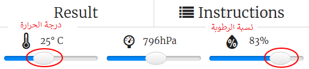

## المقدمة:

في هذا المشروع ، ستستخدم حساسي درجة الحرارة والرطوبة في مشروع Sense HAT للتنبؤ عندما تكون هناك فرصة جيدة لاكتشاف قوس قزح. عند تحقق الشروط المناسبة، سيعرض قوس قزح على المصفوفة الضوئية Sense HAT LED Matrix.

  <iframe src="https://trinket.io/embed/python/eaea4cb76c?outputOnly=true&start=result" width="600" height="500" frameborder="0" marginwidth="0" marginheight="0" allowfullscreen mark="crwd-mark">
</iframe> 

في محاكي Trinket، يمكنك تحريك أشرطة التمرير لتغيير درجة الحرارة ودرجة الرطوبة، وهي تبدو كما يلي:

ستحصل على قوس قزح إذا كانت درجة الحرارة أعلى من 20 درجة مئوية ودرجة الرطوبة تزيد عن 80 في المائة. حاول التجربة للعثور على الأحوال الجوية لأشعة الشمس (أصفر) والثلج (أبيض).

### معلومات إضافية لقادة النادي

إذا كنت بحاجة إلى طباعة هذا المشروع، فيُرجى استخدام [النسخة القابلة للطباعة](https://projects.raspberrypi.org/en/projects/rainbow-predictor/print).

## \--- collapse \---

## title: ملاحظات قادة النادي

## مقدمة:

في هذا المشروع، سيتعلم الأطفال كيفية استخدام حساساتSense HAT لاكتشاف حالة الطقس، وعرض قوس قزح باستخدام مصفوفة ضوئية LED Matrix عندما يكون الطقس دافئ ورطب.

## الموارد المتوفرة على الإنترنت

** يستخدم هذا المشروع لغة Python 3. ** نوصي بإستخدام محاكي [trinket](https://trinket.io/) للكتابة بلغة الـ Python عبر الانترنت. يحتوي هذا المشروع على Trinket التالية:

* [مشروع البداية ل "توقع قوس قزح" - jumpto.cc/rainbow-go](http://jumpto.cc/rainbow-go)

والتالي أيضًا trinket يحتوي على المشروع المكتمل:

* [مشروع الكامل ل "توقع قوس قزح" - trinket.io/python/eaea4cb76c](https://trinket.io/python/eaea4cb76c)

## الموارد المتوفرة دون اتصال بالإنترنت

يمكن أيضًا إكمال هذا المشروع بدون اتصال جهازك بالإنترنت  على جهاز كمبيوتر Raspberry Pi به Sense HAT. يمكنك الوصول إلى موارد المشروع من خلال النقر فوق رابط "مواد المشروع" الخاص بهذا المشروع. يحتوي هذا الرابط على قسم "موارد المشروع"، الذي يتضمن الموارد التي يحتاج إليها الأطفال لإكمال هذا المشروع من دون اتصال أجهزتهم بالإنترنت. تأكد من أن كل متعلم بإمكانه الوصول إلى نسخة من هذه الموارد. يتضمن هذا القسم الملفات التالية:

* rainbow/rainbow.py

يمكنك أيضًا العثور على نسخة كاملة من هذا المشروع في قسم "موارد المتطوعين"، الذي يحتوي على:

* rainbow-finished/rainbow.py

(جميع الموارد المذكورة أعلاه قابلة للتنزيل أيضًا كملفات `.zip` للمشاريع والمتطوعين)

## أهداف التعلم

* الحوسبة الملموسة - الحساسات؛
* العمليات المنطقية AND؛ 
* الألوان RGB؛
* لوحة عرض Sense HAT؛

This project covers elements from the following strands of the [Raspberry Pi Digital Making Curriculum](https://rpf.io/curriculum):

* [إنشاءات برمجية مدمجة لحل مشكلة.](https://www.raspberrypi.org/curriculum/programming/builder)

## التحديات

* حالة طقس أخرى - عرض صور مختلفة تحت ظروف الطقس المختلفة. 

\--- /collapse \---

## \--- collapse \---

## مواد المشروع

## موارد المشروع

* [Starter project](http://jumpto.cc/rainbow-go)
* [Offline starter Python file](resources/rainbow-rainbow.py)

## موارد قادة النادي

* [Online completed Trinket project](https://trinket.io/python/eaea4cb76c)
* [rainbow-finished/rainbow.py](resources/rainbow-final-rainbow.py)

\--- /collapse \---