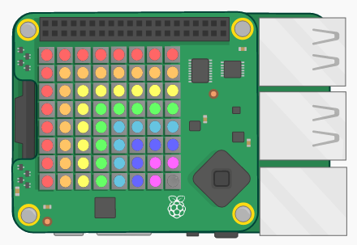

## المقدمة:

In this project you will use the temperature and humidity sensors on the Sense HAT to predict when there’s a good chance of spotting a rainbow. When the right conditions are detected you will display a rainbow on the Sense HAT LED Matrix.

  <iframe src="https://trinket.io/embed/python/eaea4cb76c?outputOnly=true&start=result" width="600" height="500" frameborder="0" marginwidth="0" marginheight="0" allowfullscreen mark="crwd-mark">
</iframe> 

In the Trinket emulator you can move the sliders to change the temperature and humidity, they look like this:

You'll get a rainbow if the temperature is over 20 degrees C and the humidity is over 80 percent. Try experimenting to find the weather conditions for sunshine (yellow) and snow (white).

### معلومات إضافية لقادة النادي

إذا كنت بحاجة إلى طباعة هذا المشروع، فيُرجى استخدام [النسخة القابلة للطباعة](https://projects.raspberrypi.org/en/projects/rainbow-predictor/print).

## \--- collapse \---

## title: ملاحظات قادة النادي

## مقدمة:

In this project, children will learn how to use the Sense HAT sensors to detect the weather, and display a rainbow using the LED matrix when it's warm and humid.

## الموارد المتوفرة على الإنترنت

**This project uses Python 3.** We recommend using [Trinket](https://trinket.io/) to write Python online. يحتوي هذا المشروع على Trinket التالية:

* ['Rainbow Predictor' Starter Trinket -- jumpto.cc/rainbow-go](http://jumpto.cc/rainbow-go)

وهناك أيضًا trinket تحتوي على المشروع المكتمل:

* [‘Rainbow Predictor’ Finished -- trinket.io/python/eaea4cb76c](https://trinket.io/python/eaea4cb76c)

## الموارد المتوفرة دون اتصال بالإنترنت

This project can also be [completed offline](https://www.codeclubprojects.org/en-GB/resources/physical-sense-hat/) on a Raspberry Pi computer with a Sense HAT. يمكنك الوصول إلى موارد المشروع من خلال النقر فوق رابط "مواد المشروع" الخاص بهذا المشروع. يحتوي هذا الرابط على قسم "موارد المشروع"، الذي يتضمن الموارد التي يحتاج إليها الأطفال لإكمال هذا المشروع من دون اتصال بالإنترنت. تأكد من أن كل طفل لديه حق الوصول إلى نسخة من هذه الموارد. يتضمن هذا القسم الملفات التالية:

* rainbow/rainbow.py

يمكنك أيضًا العثور على نسخة كاملة من هذا المشروع في قسم "موارد المتطوعين"، الذي يحتوي على:

* rainbow-finished/rainbow.py

(جميع الموارد المذكورة أعلاه قابلة للتنزيل أيضًا كملفات `.zip` للمشاريع والمتطوعين)

## أهداف التعلم

* Physical computing - sensors;
* Boolean AND; 
* RGB Colours;
* Sense HAT display;

يتناول هذا المشروع عناصر من معايير المناهج الرقمية الخاصة بـ [Raspberry Pi](http://rpf.io/curriculum):

* [إنشاءات برمجية مدمجة لحل مشكلة.](https://www.raspberrypi.org/curriculum/programming/builder)

## التحديات

* More Weather - display different images under different weather conditions. 

\--- /collapse \---

## \--- collapse \---

## مواد المشروع

## موارد المشروع

* [ملف.zip يحتوي على جميع موارد المشروع](resources/rainbow-project-resources.zip)
* [Starter project](http://jumpto.cc/rainbow-go)
* [Offline starter Python file](resources/rainbow-rainbow.py)

## موارد قادة النادي

* [ملف.zip يحتوي على جميع موارد المشروع المكتملة](resources/rainbow-volunteer-resources.zip)
* [مشروع Trinket المكتمل على الإنترنت](https://trinket.io/python/eaea4cb76c)
* [rainbow-finished/rainbow.py](resources/rainbow-final-rainbow.py)

\--- /collapse \---