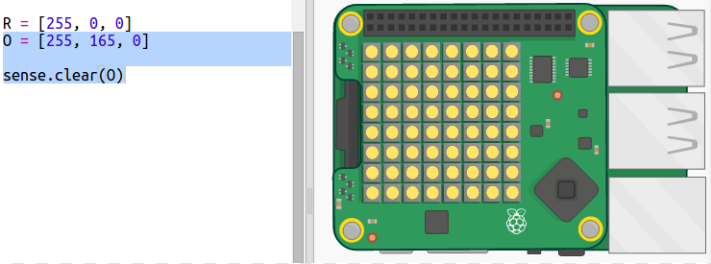
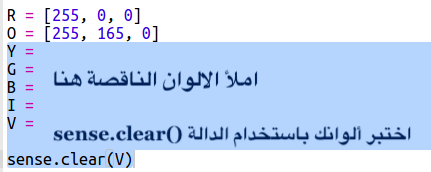
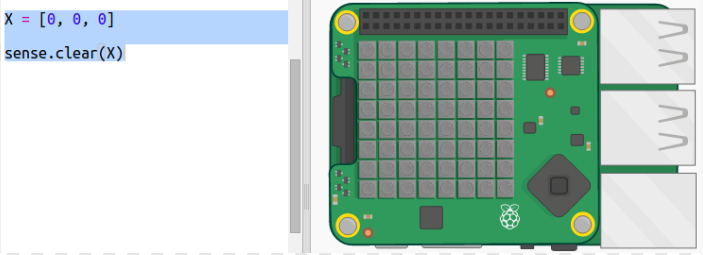
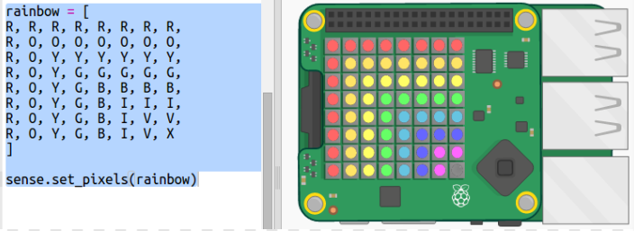

## رسم قوس قزح

لنرسم أولاً قوس قزح بإستخدام مصفوفة ضوئية LED في Sense HAT. الألوان هي الأحمر والبرتقالي والأصفر والأخضر والأزرق والنيلي والبنفسجي.

لتحديد لون LED فردي، نحتاج إلى تحديد مقدار اللون الأحمر والأخضر والأزرق الذي يجب أن يكون عليه من 0 إلى 255.

+ افتح ملف Rainbow Predictor Starter: <a href="http://jumpto.cc/rainbow-go" target="_blank"> jumpto.cc/rainbow-go </a>.
    
    **تم إعداد كود Sense HAT لك.**

+ قم بإضافة الكود المظلل لإعداد متغير للون الأحمر ثم قم بتحويل جميع وحدات البكسل إلى اللون الأحمر باستخدام `sens.clear(R)`:
    
    
    
    تأكد من إستخدام حرف `R` الكبير.

+ اللون البرتقالي هو التالي. اللون البرتقالي هو مزيج بين اللونين الأحمر والأخضر. يمكنك تغيير الأرقام حتى تحصل على اللون البرتقالي الذي يعجبك. استخدم `sense.clear(O)` هذه المرة لاختبار اللون الجديد، مع التأكد من استخدام حرف `O` كبير بين قوسين.
    
    

+ أضف الآن المتغيرات `Y`, `G`, `B`, `I`, `V` بحيث يكون لديك ألوان قوس قزح السبعة. يمكنك البحث على المزيد من الألوان في <a href="http://jumpto.cc/colours" target="_blank"> jumpto.cc/colours </a>
    
    يمكنك اختبار ألوانك باستخدام `sense.clear()`.
    
    

+ أضف متغير `X` لإيقاف تشغيل وحدات البكسل (بدون أحمر أو أخضر أو أزرق):
    
    

+ حان الوقت الآن لرسم قوس قزح. تحتاج إلى إعداد قائمة تحتوي على لون كل بكسل ثم استدعاء `set_pixels` مع قائمة من الألوان. لتقليل الكتابة، يمكنك نسخ قوس قزح من `snippets.py` في مشروعك.
    
    