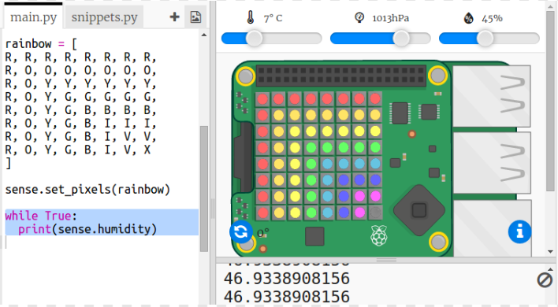

## قراءة البيانات من الحساس

يحتوي Sense HAT على مجموعة متنوعة من الحساسات التي توفر بيانات حقيقية على جهاز كمبيوتر Raspberry Pi. يتيح لك Sense HAT Emulator في Trinket كتابة واختبار مشاريع لـ Sense HAT في متصفح الويب الخاص بك.

يشير حساس الرطوبة إلى كمية الرطوبة الموجودة في الهواء. الرطوبة تكون عالية عندما يكون الجو ماطراً.

+ لنقرأ من حساس الرطوبة ونطبع النتيجة على الشاشة. أضف الكود المظلل إلى الجزء السفلي من النص البرمجي.
    
    

+ اختبر البرنامج عن طريق تحريك شريط قيمة الرطوبة إلى قيم مختلفة.
    
    
    
    لاحظ أن القيمة التي تحصل عليها من حساس الرطوبة ليست بالضبط نفس القيمة الموجودة على شريط قيمة الرطوبة. هذا لأن حساس الرطوبة ليس دقيق تمامًا.