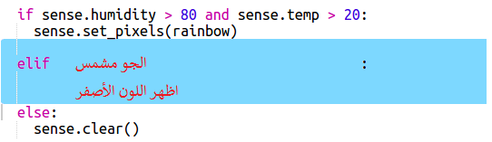

\--- challenge \---

## تحدي: المزيد من الطقس

هل يمكنك عرض صورة الشمس عندما تكون درجة الحرارة أعلى من 20 ونسبة الرطوبة أقل من 80٪.

تلميح: استخدم ` elif ` للتحقق من أنواع الطقس الأخرى. لكل نوع من أنواع الطقس، ستحتاج إلى لوجود شرط للتحقق من نوع الطقس ومن ثم وجود كود لعرضه على Sense HAT.

تلميح: يمكنك إنشاء شمس بسيطة عن طريق تعيين جميع وحدات البكسل إلى اللون الأصفر باستخدام ` clear () `. أو يمكنك محاولة إنشاء صورة بكسل كما فعلت مع قوس قزح.

ماذا عن صورة الثلج إذا كانت نسبة الرطوبة أعلى من 80 ٪ ودرجة الحرارة أقل من الصفر.

تلميح: عيّن الأحمر والأخضر والأزرق للحد الأقصى 255 لإنشاء اللون الأبيض.

\--- /challenge \---