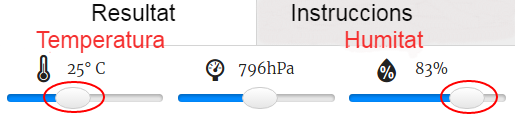

## Introducció

En aquest projecte faràs servir els sensors de temperatura i humitat de la placa Sense HAT per predir quan hi ha una bona possibilitat de què aparegui un arc de Sant Martí. Quan es detectin les condicions adequades, apareixerà un arc de Sant Martí a la matriu de leds del Sense HAT.

  <iframe src="https://trinket.io/embed/python/eaea4cb76c?outputOnly=true&start=result" width="600" height="500" frameborder="0" marginwidth="0" marginheight="0" allowfullscreen mark="crwd-mark">
</iframe> 

A l'emulador Trinket pots moure els control lliscants per canviar la temperatura i la humitat, així es veuen:

Obtindràs un arc de Sant Martí si la temperatura supera els 20 graus C i la humitat és superior al 80 per cent. Experimenta per trobar les condicions meteorològiques de sol (groc) i neu (blanc).

### Informació addicional per als líders del club

Si necessites imprimir aquest projecte, si us plau utilitza la [versió per a imprimir](https://projects.raspberrypi.org/ca-ES/projects/rainbow-predictor/print).

--- collapse ---
---
title: Notes pel líder del club
---

## Introducció:

En aquest projecte, els nens aprendran a utilitzar els sensors de la placa Sense HAT per detectar el clima i mostraran un arc de Sant Martí utilitzant la matriu LED quan fa càlid i humit.

## Recursos en línia

**Aquest projecte utilitza Python 3.** Et recomanem que facis servir [Trinket](https://trinket.io/) per escriure codi Python en línia. Aquest projecte conté els següents Trinkets:

* [Trinket d'inici del predictor de l'arc de Sant Martí -- jumpto.cc/rainbow-go](http://jumpto.cc/rainbow-go)

També hi ha un trinket que conté el projecte acabat:

* [‘Predictor de l'arc de Sant Martí’ Acabat -- trinket.io/python/8c8282f351](https://trinket.io/python/8c8282f351)

## Recursos fora de línia

Aquest projecte també es pot [finalitzar fora de línia](https://www.codeclubprojects.org/en-GB/resources/physical-sense-hat/) en un equip Raspberry Pi amb una placa Sense HAT. Pots accedir als recursos del projecte fent clic a l’enllaç “Materials del projecte”. Aquest enllaç conté una secció "Recursos del projecte", que inclou recursos que els nens necessitaran per completar el projecte fora de línia. Assegureu-vos que cada nen tingui accés a una còpia d'aquests recursos. Aquesta secció inclou els fitxers següents:

* rainbow/rainbow.py

També pots trobar una versió acabada d'aquest projecte a la secció "Recursos de voluntaris", que conté:

* rainbow-finished/rainbow.py

(Tots els recursos anteriors es poden descarregar com fitxers `.zip` de projectes i voluntaris.)

## Objectius d'aprenentatge

* Informàtica física - sensors;
* Operador booleà AND; 
* Colors RGB;
* Pantalla de la placa Sense HAT;

Aquest projecte tracta elements dels següents aspectes del [Currículum de Fabricació Digital de Raspberry Pi](http://rpf.io/curriculum):

* [Combineu les formes de la programació per resoldre un problema.](https://www.raspberrypi.org/curriculum/programming/builder)

## Reptes

* Més Temps - mostra imatges diferents en condicions meteorològiques diferents. 

--- /collapse ---

--- collapse ---
---
title: Materials del projecte
---

## Recursos del projecte

* [Fitxer .zip que conté tots els recursos del projecte](resources/rainbow-project-resources.zip)
* [Projecte d’inici](http://jumpto.cc/rainbow-go)
* [Fitxer Python d’inici fora de línia](resources/rainbow-rainbow.py)

## Recursos del líder del club

* [Fitxer .zip que conté tots els recursos del projecte complet](resources/rainbow-volunteer-resources.zip)
* [Projecte Trinket complet en línia](https://trinket.io/python/8c8282f351)
* [rainbow-finished/rainbow.py](resources/rainbow-final-rainbow.py)

--- /collapse ---