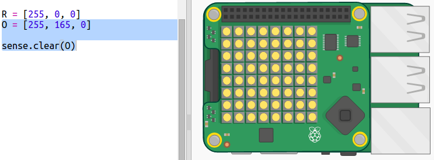

## Drawing a rainbow

First let's draw a rainbow using the LED Matrix on the Sense HAT. The colours are Red, Orange, Yellow, Green, Blue, Indigo and Violet.

To set the colour of an individual LED we need to say how much red, green and blue it should have from 0 to 255.

+ Open the Rainbow Predictor Starter Trinket: <a href="http://jumpto.cc/rainbow-go" target="_blank">jumpto.cc/rainbow-go</a>.
    
    **The code to set up the Sense HAT has been included for you.**

+ Add the highlighted code to set up a variable for the colour Red and then turn all the pixels red using `sense.clear(R)`:
    
    
    
    Make sure you use a capital letter `R`.

+ Orange is next. Orange is red mixed with green. You can adjust the numbers until you get an orange that you like. Use `sense.clear(O)` this time to test the new colour, making sure to use a capital letter `O` in the brackets.
    
    

+ Now add variables `Y`, `G`, `B`, `I`, `V` so that you have the seven colours of the rainbow. You can look up RGB colours at <a href="http://jumpto.cc/colours" target="_blank">jumpto.cc/colours</a>
    
    You can test your colours using `sense.clear()`.
    
    

+ Add a variable `X` for setting pixels to off (no red, green or blue):
    
    

+ Now it's time to draw a rainbow. You need to set up a list containing the colour of each pixel and then call `set_pixels` with the list of colours. To save typing you can copy the rainbow from `snippets.py` in your project.
    
    