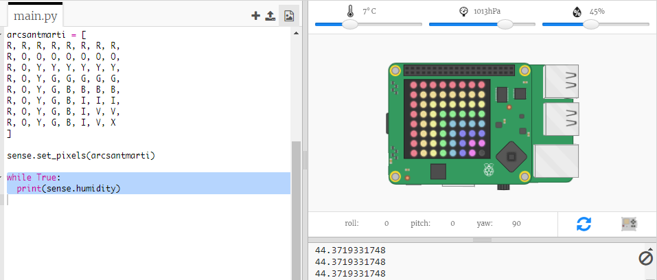

## Llegint les dades del sensor

La placa Sense HAT té una gamma de sensors que proporcionen dades del món real a un ordinador Raspberry Pi. L’emulador de Sense HAT a Trinket et permet escriure i provar projectes per a Sense HAT en el teu navegador web.

El sensor d’humitat informa de la quantitat d’humitat a l’aire. La humitat és alta quan plou.

+ Anem a llegir del sensor d’humitat i mostrar el resultat. Add the highlighted code to the bottom of your script.
    
    

+ Test your program by moving the humidity slider to different values.
    
    
    
    Notice that the value you get back from the humidity sensor isn't exactly the same as the value on the slider. This is because the sensors aren't perfectly accurate.