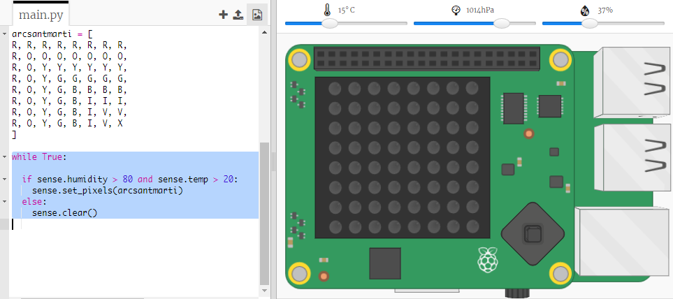

## Predient un arc de Sant Martí

L'arc de Sant Martí es produeix quan la llum del sol passa a través de gotes d'aigua a l'angle correcte (normalment a la tarda.) Si fa calor i la humitat és alta, val la pena comprovar si hi ha un arc de Sant Martí.

+ Ara només mostrem l’arc de Sant Martí si les condicions són correctes. Canvia el codi perquè sembli així:
    
    
    
    No pots estar segur que hi hagi un arc de Sant Martí quan es compleixin aquestes condicions, però val la pena intentar-ho.

+ Prova de canviar els valors del control lliscant fins que vegis l'arc de Sant Martí.
    
    
    
    Recorda que els valors indicats no seran exactament els mateixos que els que es mostren en els control lliscants.

+ Un *llindar* és un nombre que indica un canvi important. 20 ºC i un 80% d’humitat són llindars per al detector de l’arc de Sant Martí.
    
    Prova de canviar els llindars i, a continuació, mou els control lliscants per activar un arc de Sant Martí.
    
    Si estàs treballant amb una placa física de Sense HAT, pots provar el teu codi establint els llindars a valors baixos.