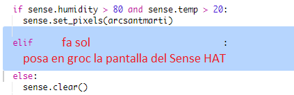

--- challenge ---

## Repte: Més Temps

Pots mostrar la imatge d'un sol quan la temperatura sigui superior a 20 i la humitat per sota del 80%.

Consell: Utilitza `elif` per comprovar altres tipus de temps. Per a cada tipus de temps, hauràs d’incloure una condició per comprovar quin tipus és i el codi necessari per mostrar-lo a la pantalla de la placa Sense HAT.

Consell: Pots crear un sol senzill fixant tots els píxels a groc amb `clear()`. O pots provar de crear una imatge de píxels com ho has fet amb l'arc de Sant Martí.

I què tal una imatge de neu si la humitat està per sobre del 80% i la temperatura és inferior a zero.

Consell: Configura vermell, verd i blau al valor màxim (=255) per crear el blanc.

--- /challenge ---