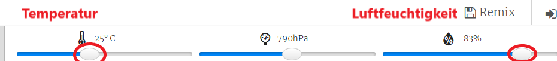

## Einleitung:

In diesem Projekt wirst du die Temperatur- und Feuchtigkeitssensoren des Sense Hat verwenden, um vorherzusagen, wann eine gute Chance besteht, einen Regenbogen zu entdecken. Wenn die richtigen Bedingungen erkannt wurden, wird auf der Sense HAT LED Matrix ein Regenbogen angezeigt.

  <iframe src="https://trinket.io/embed/python/eaea4cb76c?outputOnly=true&start=result" width="600" height="500" frameborder="0" marginwidth="0" marginheight="0" allowfullscreen mark="crwd-mark">
</iframe> 

Im Trinket-Emulator kannst du die Schieberegler bewegen, um Temperatur und Luftfeuchtigkeit zu ändern. Sie sehen folgendermaßen aus:

Du wirst einen Regenbogen erhalten, wenn die Temperatur über 20 Grad Celsius und die Luftfeuchtigkeit über 80 Prozent liegt. Versuche zu experimentieren, um die Wetterbedingungen für Sonnenschein (gelb) und Schnee (weiß) zu ermitteln.

### Zusätzliche Information für Clubleiter

Falls du dieses Projekt ausdrucken musst, verwende bitte die [druckfreundliche Version](https://projects.raspberrypi.org/en/projects/rainbow-predictor/print).

## \--- collapse \---

## title: Anmerkungen für Clubleiter

## Einleitung:

In diesem Projekt werden Kinder lernen, wie sie mit den Sense HAT-Sensoren das Wetter erfassen und einen Regenbogen mithilfe der LED-Matrix darstellen, wenn es warm und feucht ist.

## Online-Ressourcen

**Dieses Projekt verwendet Python 3.** Wir empfehlen die Verwendung von [trinket](https://trinket.io/), um Python-Programme online zu schreiben. Dieses Projekt enthält die folgenden Trinkets:

* ['Regenbogen-Vorhersager' Basis-Trinket -- jumpto.cc/rainbow-go](http://jumpto.cc/rainbow-go)

Außerdem ist ein trinket mit dem vollständigen Projekt verfügbar:

* ['Regenbogen-Vorhersager' fertiggestellt -- trinket.io/python/eaea4cb76c](https://trinket.io/python/eaea4cb76c)

## Offline-Ressourcen

Dieses Projekt kann auch [offline abgeschlossen werden](https://www.codeclubprojects.org/en-GB/resources/physical-sense-hat/) auf einem Raspberry Pi-Computer mit einem Sense HAT. Du kannst auf die Projektressourcen zugreifen, indem du auf den Link "Projektmaterial" für dieses Projekt klickst. Dieser Link enthält einen Abschnitt "Projektressourcen" mit Ressourcen, die die Kinder benötigen, um das Projekt offline abschließen zu können. Stelle sicher, dass jedes Kind Zugriff auf eine Kopie dieser Ressourcen hat. Dieser Abschnitt enthält die folgenden Dateien:

* rainbow/rainbow.py

Eine vollständige Version dieses Projekts findest du auch im Abschnitt "Ressourcen für Freiwillige Mitarbeiter" mit diesem Inhalt:

* rainbow-finished/rainbow.py

(Alle oben genannten Ressourcen können auch als `.zip`-Dateien für Projekte und für Freiwillige heruntergeladen werden.)

## Lernziele

* Digitales Basteln-Sensoren;
* Boolesches UND; 
* RGB (Rot, Grün, Blau) Farben;
* Sense HAT Display;

Dieses Projekt deckt die folgenden Kernbereiche des [Raspberry Pi Digital Making Curriculum](http://rpf.io/curriculum) ab:

* [Verschiedene Programmierkonstrukte kombinieren um ein Problem zu lösen.](https://www.raspberrypi.org/curriculum/programming/builder)

## Herausforderungen

* Mehr Wetter - zeige verschiedene Bilder unter unterschiedlichen Wetterbedingungen. 

\--- /collapse \---

## \--- collapse \---

## title: Projektmaterial

## Projektressourcen

* [.zip-Datei mit allen Projektressourcen](resources/rainbow-project-resources.zip)
* [Basisprojekt](http://jumpto.cc/rainbow-go)
* [Offline Basis Python-Datei](resources/rainbow-rainbow.py)

## Ressourcen für Clubleiter

* [.zip-Datei mit allen fertig gestellten Projektressourcen](resources/rainbow-volunteer-resources.zip)
* [Vollständiges Trinket-Projekt (online)](https://trinket.io/python/eaea4cb76c)
* [rainbow-finished/rainbow.py](resources/rainbow-final-rainbow.py)

\--- /collapse \---