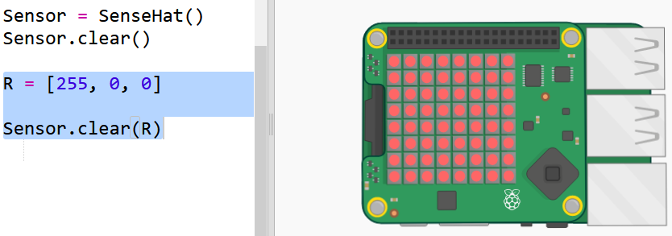
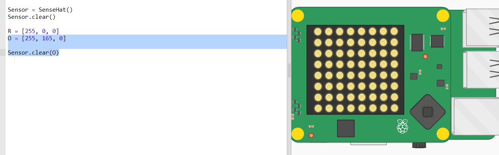
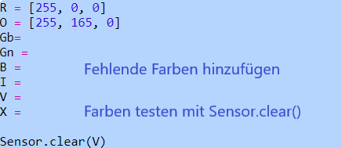
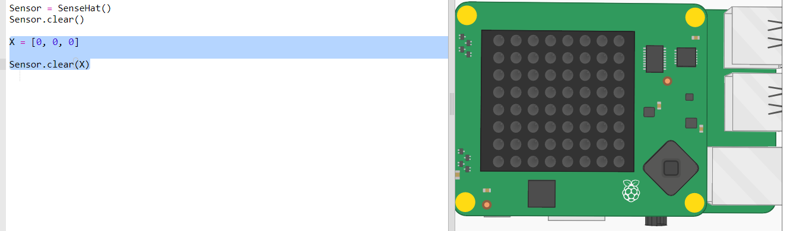
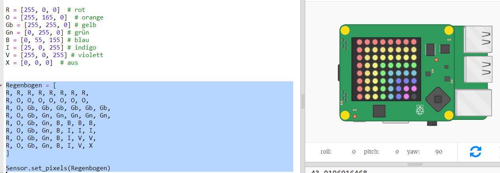

## Einen Regenbogen zeichnen

Zuerst zeichnen wir einen Regenbogen mit der LED-Matrix auf dem Sense-HAT. Die Farben sind Rot, Orange, Gelb, Grün, Blau, Indigo und Violett.

Um die Farbe einer einzelnen LED einzustellen, müssen wir sagen, wie viel Rot, Grün und Blau sie von 0 bis 255 haben soll.

+ Öffne das Regenbogen-Vorhersager Basis-Trinket: <a href="http://jumpto.cc/rainbow-go" target="_blank">jumpto.cc/rainbow-go</a>.
    
    **Der Code zum Einrichten der Sense HAT ist für dich enthalten.**

+ Füge den hervorgehobenen Code hinzu, um eine Variable für die Farbe Rot einzurichten, und Dann mache alle Pixel rot mit `Sensor.clear(R)`:
    
    
    
    Stelle sicher, dass du einen Großbuchstaben `R` verwendest.

+ Orange ist die Nächste. Orange ist rot gemischt mit grün. Du kannst die Zahlen so lange anpassen, bis du eine Orange bekommst, was dir gefällt. Verwende dieses Mal `Sensor.clear(O)`, um die neue Farbe zu testen. Stelle sicher, dass du einen Großbuchstaben `O` in den Klammern verwendest.
    
    

+ Füge nun die Variablen `Gb`, `Gn`, `B`, `I`, `V` hinzu, damit du die sieben Farben des Regenbogens hast. Hier kannst du RGB-Farben nachschauen: <a href="http://jumpto.cc/colours" target="_blank">jumpto.cc/colours</a>
    
    Du kannst deine Farben mit `Sensor.clear()` testen.
    
    

+ Füge eine Variable `X` hinzu, um Pixel auszuschalten (ohne Rot, Grün oder Blau):
    
    

+ Jetzt ist es Zeit, einen Regenbogen zu zeichnen. Du musst dafür eine Liste mit der Farbe jedes Pixels einrichten und dann `set_pixels` mit der Liste der Farben aufrufen. Um die Eingabe zu speichern, kannst du den Regenbogen von `snippets.py` in dein Projekt kopieren.
    
    