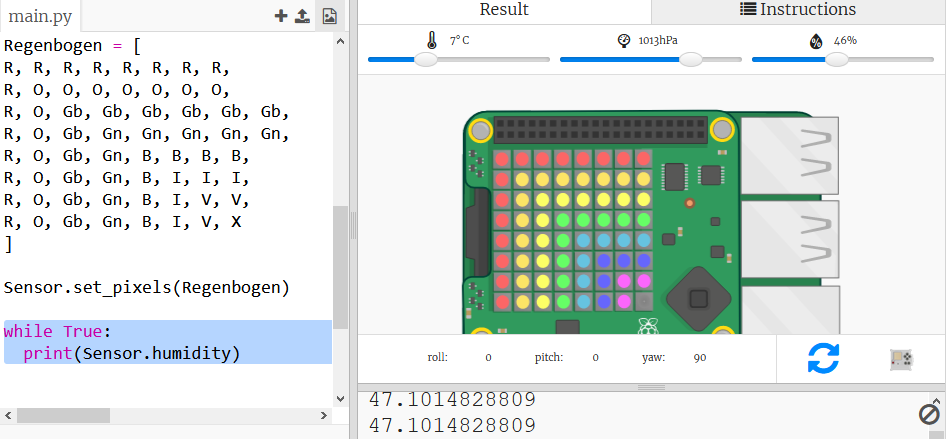

## Lese die Sensordaten

Das Sense HAT verfügt über eine Reihe von Sensoren, die reale Daten auf einem Raspberry Pi Computer zur Verfügung stellen. Mit dem Sense Hat Emulator in Trinket kannst du Projekte für das Sense Hat in deinem Webbrowser schreiben und testen.

Der Feuchtigkeitssensor meldet die Feuchtigkeitsmenge in der Luft. Die Luftfeuchtigkeit ist hoch, wenn es regnet.

+ Lass uns diese vom Feuchtigkeitssensor auslesen lassen und das Ergebnis ausgeben. Füge den hervorgehobenen Code am Ende deines Skripts hinzu.
    
    

+ Teste dein Programm, indem du den Feuchtigkeitsregler auf andere Werte verschiebst.
    
    
    
    Beachte, dass der Wert, den du vom Feuchtigkeitssensor zurückerhälst, nicht genau der gleiche Wert ist, wie der Wert auf dem Schieberegler. Das liegt daran, dass die Sensoren nicht ganz genau sind.