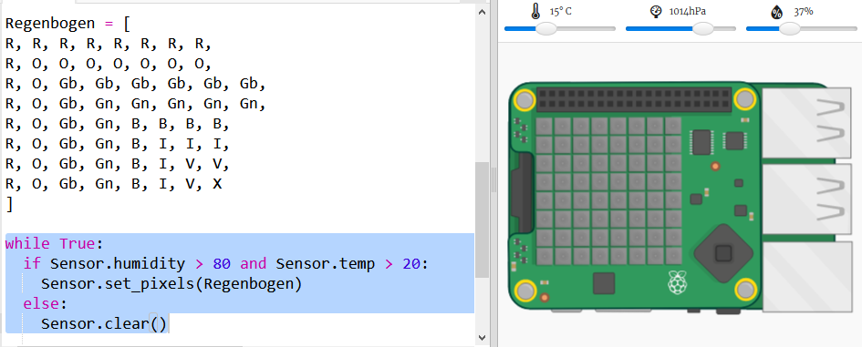

## Vorhersage eines Regenbogens

Regenbogen entstehen, wenn die Sonne im richtigen Winkel (normalerweise nachmittags) durch Wassertropfen scheint. Wenn es warm ist und die Luftfeuchtigkeit hoch ist, lohnt es sich zu prüfen, ob es einen Regenbogen gibt.

+ Lasse nun nur den Regenbogen anzeigen, wenn die Bedingungen stimmen. Ändere deinen Code, damit er so aussieht:
    
    
    
    Du kannst nicht sicher sein, dass es einen Regenbogen gibt, wenn diese Bedingungen erfüllt sind, aber es lohnt sich einen Blick darauf zu werfen.

+ Versuche, die Werte auf dem Schieberegler zu ändern, bis du den Regenbogen siehst.
    
    
    
    Beachte, dass die gemeldeten Werte nicht genau die gleichen sein werden wie die auf den Schiebereglern.

+ Ein *Schwellenwert* ist eine Zahl, die eine wichtige Änderung anzeigt. 20 Grad Celsius und 80% Luftfeuchtigkeit sind Schwellenwerte für den Regenbogen-Detektor.
    
    Versuche die Schwellwerte zu ändern und dann die Schieberegler zu verschieben, um einen Regenbogen auszulösen.
    
    Wenn du mit einem echten Sense-HAT arbeitest, kannst du deinen Code testen, indem du die Schwellenwerte auf niedrige Werte setzt.