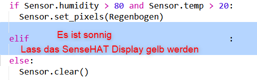

\--- challenge \---

## Challenge: More Weather

Can you display a sun image when the temperature is above 20 and the humidity is below 80%.

Tip: Use `elif` to check for other kinds of weather. For each kind of weather you'll need to include a condition to check for a kind of weather and then code to set the display on the Sense HAT.

Tip: You can create a simple sun by setting all the pixels to yellow with `clear()`. Or you can try creating a pixel image like you did with the rainbow.

How about a snow image if the humidity is above 80% and the temperature is below zero.

Tip: Set red, green and blue to the maximum of 255 to create white.

\--- /challenge \---