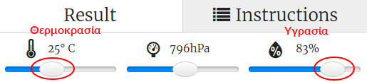

## Εισαγωγή:

Σε αυτό το έργο θα χρησιμοποιήσεις τους αισθητήρες θερμοκρασίας και υγρασίας στο Sense HAT για να προβλέψεις πότε υπάρχει καλή πιθανότητα να εντοπίσεις ένα ουράνιο τόξο. Όταν εντοπιστούν οι κατάλληλες συνθήκες, θα εμφανιστεί ένα ουράνιο τόξο στο LED Matrix του Sense Hat.

  <iframe src="https://trinket.io/embed/python/eaea4cb76c?outputOnly=true&start=result" width="600" height="500" frameborder="0" marginwidth="0" marginheight="0" allowfullscreen mark="crwd-mark">
</iframe> 

Στον προσομοιωτή Trinket μπορείς να μετακινήσεις τους ρυθμιστές για να αλλάξεις τη θερμοκρασία και την υγρασία. Οι ρυθμιστές μοιάζουν με την παρακάτω εικόνα:

Θα εμφανιστεί ένα ουράνιο τόξο εάν η θερμοκρασία είναι πάνω από 20 βαθμούς C και η υγρασία είναι πάνω από 80%. Δοκίμασε να πειραματιστείς για να βρεις τις καιρικές συνθήκες για ηλιοφάνεια (κίτρινο) και χιόνι (λευκό).

### Πρόσθετες πληροφορίες για τους αρχηγούς των ομάδων

Αν χρειαστεί να εκτυπώσεις αυτό το έργο, χρησιμοποίησε την [εκτυπώσιμη έκδοση](https://projects.raspberrypi.org/en/projects/rainbow-predictor/print).

## \--- collapse \---

## title: Σημειώσεις συντονιστή ομάδας

## Εισαγωγή:

Σε αυτό το έργο, τα παιδιά θα μάθουν πώς να χρησιμοποιούν τους αισθητήρες Sense HAT για να ανιχνεύουν τον καιρό και να εμφανίζουν ένα ουράνιο τόξο χρησιμοποιώντας το LED Matrix όταν έχει ζέστη και υγρασία.

## Online Πόροι

**Αυτό το έργο χρησιμοποιεί Python 3.** Συνιστούμε να χρησιμοποιήσεις το [trinket](https://trinket.io/) για να γράψεις Python online. Το έργο αυτό περιλαμβάνει τα ακόλουθα Trinkets:

* [Αρχικό Trinket 'Rainbow Predictor' -- jumpto.cc/rainbow-go](http://jumpto.cc/rainbow-go)

Υπάρχει επίσης ένα trinket που περιέχει το ολοκληρωμένο έργο:

* [Ολοκληρωμένο ‘Rainbow Predictor’ -- trinket.io/python/eaea4cb76c](https://trinket.io/python/eaea4cb76c)

## Offline Πόροι

Αυτό το έργο μπορεί επίσης [να ολοκληρωθεί εκτός σύνδεσης](https://www.codeclubprojects.org/en-GB/resources/physical-sense-hat/) σε υπολογιστή Raspberry Pi με Sense HAT. Μπορείς να αποκτήσεις πρόσβαση στους πόρους του έργου κάνοντας κλικ στο σύνδεσμο «Υλικό έργου» για το έργο αυτό. Αυτός ο σύνδεσμος περιέχει μια ενότητα "Πόροι έργου", η οποία περιλαμβάνει υλικό που τα παιδιά θα χρειαστούν για να ολοκληρώσουν αυτό το έργο εκτός σύνδεσης. Βεβαιώσου ότι κάθε παιδί έχει πρόσβαση σε ένα αντίγραφο αυτών των πόρων. Αυτή η ενότητα περιλαμβάνει τα ακόλουθα αρχεία:

* rainbow/rainbow.py

Μπορείς επίσης να βρεις μια ολοκληρωμένη έκδοση αυτού του έργου στην ενότητα «Πόροι εθελοντών», η οποία περιέχει:

* rainbow-finished/rainbow.py

(Όλοι οι παραπάνω πόροι μπορούν επίσης να κατέβουν ως συμπιεσμένα `.zip` αρχεία.)

## Στόχοι μάθησης

* Physical computing - αισθητήρες
* Τελεστής AND του Boole˙ 
* Χρώματα RGB
* Οθόνη Sense Hat

Αυτό το έργο καλύπτει στοιχεία από τις ακόλουθες πτυχές του [Raspberry Pi Digital Making Curriculum ](http://rpf.io/curriculum):

* [Συνδύασε δομές προγραμματισμού για να λύσεις ένα πρόβλημα.](https://www.raspberrypi.org/curriculum/programming/builder)

## Προκλήσεις

* Περισσότερα Καιρικά Φαινόμενα - εμφάνισε διαφορετικές εικόνες για διαφορετικές καιρικές συνθήκες. 

\--- /collapse \---

## \--- collapse \---

## title: Υλικό έργου

## Πόροι έργου

* [αρχείο .zip που περιέχει όλους τους πόρους του έργου](resources/rainbow-project-resources.zip)
* [Αρχικό έργο](http://jumpto.cc/rainbow-go)
* [Offline αρχικό αρχείο Python](resources/rainbow-rainbow.py)

## Πόροι συντονιστή ομάδας

* [αρχείο .zip που περιέχει όλους τους πόρους του έργου](resources/rainbow-volunteer-resources.zip)
* [Online ολοκληρωμένο έργο στο Τrinket](https://trinket.io/python/eaea4cb76c)
* [rainbow-finished/rainbow.py](resources/rainbow-final-rainbow.py)

\--- /collapse \---