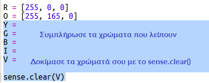

## Σχεδίαση ουράνιου τόξου

Αρχικά ας σχεδιάσουμε ένα ουράνιο τόξο χρησιμοποιώντας το LED Matrix στο Sense HAT. Τα χρώματα είναι κόκκινο, πορτοκαλί, κίτρινο, πράσινο, μπλε, λουλακί και βιολετί.

Για να ρυθμίσουμε το χρώμα μιας μεμονωμένης λυχνίας LED πρέπει να πούμε πόσα κόκκινο, πράσινο και μπλε πρέπει να έχει σε μία κλίμακα από 0 έως 255.

+ Άνοιξε το αρχικό Trinket Rainbow Predictor Starter: <a href="http://jumpto.cc/rainbow-go" target="_blank"> jumpto.cc/rainbow-go </a>.
    
    **Ο κώδικας για τη ρύθμιση του Sense HAT είναι ήδη συμπληρωμένος.**

+ Πρόσθεσε τον επισημασμένο κώδικα για να ορίσεις μια μεταβλητή για το χρώμα Κόκκινο και στη συνέχεια μετέτρεψε όλα τα εικονοστοιχεία σε κόκκινο χρησιμοποιώντας το `sense.clear(R)`:
    
    
    
    Βεβαιώσου ότι χρησιμοποιείς κεφαλαίο γράμμα `R`.

+ Το επόμενο είναι το πορτοκαλί. Το πορτοκαλί είναι αναμεμειγμένο κόκκινο με πράσινο. Μπορείς να προσαρμόσεις τους αριθμούς έως ότου λάβεις ένα πορτοκαλί που σου αρέσει. Χρησιμοποίησε το `sense.clear(O)` αυτή τη φορά για να δοκιμάσεις το νέο χρώμα, φροντίζοντας να χρησιμοποιήσεις ένα κεφαλαίο `O` στην παρένθεση.
    
    

+ Τώρα πρόσθεσε τις μεταβλητές `Y`, `Ζ`, `Β`, `I`, `V` έτσι ώστε να έχεις τα επτά χρώματα του ουράνιου τόξου. Μπορείς να βρεις περισσότερα RGB χρώματα στο <a href="http://jumpto.cc/colours" target="_blank">jumpto.cc/colours</a>
    
    Μπορείς να δοκιμάσεις τα χρώματά σου χρησιμοποιώντας το `sense.clear()`.
    
    

+ Πρόσθεσε μια μεταβλητή `X` για την απενεργοποίηση των pixel (να μην εμφανίζεται κόκκινο, πράσινο ή μπλε):
    
    

+ Τώρα ήρθε η ώρα να σχεδιάσεις ένα ουράνιο τόξο. Πρέπει να δημιουργήσεις μια λίστα που περιέχει το χρώμα κάθε εικονοστοιχείου και στη συνέχεια να καλέσεις το `set_pixels` με τη λίστα των χρωμάτων. Για να γλυτώσεις χρόνο από την πληκτρολόγηση, μπορείς να αντιγράψεις το ουράνιο τόξο από το `snippets.py` στο έργο σου.
    
    