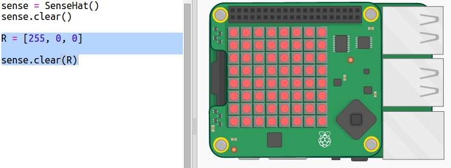

## Σχεδίαση ουράνιου τόξου

Αρχικά ας σχεδιάσουμε ένα ουράνιο τόξο χρησιμοποιώντας το LED Matrix στο Sense HAT. Τα χρώματα είναι κόκκινο, πορτοκαλί, κίτρινο, πράσινο, μπλε, λουλακί και βιολετί.

Για να ρυθμίσουμε το χρώμα μιας μεμονωμένης λυχνίας LED πρέπει να πούμε πόσα κόκκινο, πράσινο και μπλε πρέπει να έχει σε μία κλίμακα από 0 έως 255.

+ Άνοιξε το αρχικό Trinket Rainbow Predictor Starter: <a href="http://jumpto.cc/rainbow-go" target="_blank"> jumpto.cc/rainbow-go </a>.
    
    **Ο κώδικας για τη ρύθμιση του Sense HAT είναι ήδη συμπληρωμένος.**

+ Πρόσθεσε τον επισημασμένο κώδικα για να ορίσεις μια μεταβλητή για το χρώμα Κόκκινο και στη συνέχεια μετέτρεψε όλα τα εικονοστοιχεία σε κόκκινο χρησιμοποιώντας το `sense.clear(R)`:
    
    
    
    Βεβαιώσου ότι χρησιμοποιείς κεφαλαίο γράμμα `R`.

+ Το επόμενο είναι το πορτοκαλί. Το πορτοκαλί είναι αναμεμειγμένο κόκκινο με πράσινο. Μπορείς να προσαρμόσεις τους αριθμούς έως ότου λάβεις ένα πορτοκαλί που σου αρέσει. Χρησιμοποίησε το `sense.clear(O)` αυτή τη φορά για να δοκιμάσεις το νέο χρώμα, φροντίζοντας να χρησιμοποιήσεις ένα κεφαλαίο `O` στην παρένθεση.
    
    

+ Now add variables `Y`, `G`, `B`, `I`, `V` so that you have the seven colours of the rainbow. You can look up RGB colours at <a href="http://jumpto.cc/colours" target="_blank">jumpto.cc/colours</a>
    
    You can test your colours using `sense.clear()`.
    
    

+ Add a variable `X` for setting pixels to off (no red, green or blue):
    
    

+ Now it's time to draw a rainbow. You need to set up a list containing the colour of each pixel and then call `set_pixels` with the list of colours. To save typing you can copy the rainbow from `snippets.py` in your project.
    
    