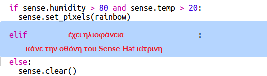

\--- challenge \---

## Πρόκληση: Περισσότερα Καιρικά Φαινόμενα

Can you display a sun image when the temperature is above 20 and the humidity is below 80%?

Συμβουλή: Χρησιμοποίησε `elif` για να ελέγξεις και για άλλες καιρικές καταστάσεις. Για κάθε καιρική κατάσταση θα χρειαστεί να συμπεριλάβεις μια συνθήκη να ελέγξεις και στη συνέχεια να προγραμματίσεις τι θα εμφανιστεί στην οθόνη στο Sense HAT.

Συμβουλή: Μπορείς να δημιουργήσεις έναν απλό ήλιο ορίζοντας όλα τα εικονοστοιχεία κίτρινα με την εντολή `clear()`. Ή μπορείς να δοκιμάσεις να δημιουργήσεις μια εικόνα εικονοστοιχείων όπως έκανες με το ουράνιο τόξο.

How about a snow image if the humidity is above 80% and the temperature is below zero?

Συμβουλή: Όρισε το κόκκινο, το πράσινο και το μπλε στη μέγιστη 255 για να δημιουργήσεις λευκό.

\--- /challenge \---