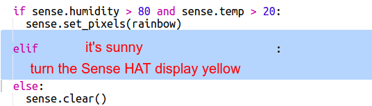
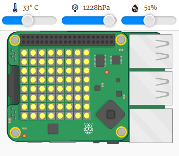

--- challenge ---
## Challenge: More Weather

Can you display a sun image when the temperature is above 20 and the humidity is below 80%. 

Tip: Use `elif` to check for other kinds of weather. For each kind of weather you'll need to include a condition to check for a kind of weather and then code to set the display on the Sense HAT.

Tip: You can create a simple sun by setting all the pixels to yellow with `clear()`. Or you can try creating a pixel image like you did with the rainbow. 

How about a snow image if the humidity is above 80% and the temperature is below zero.

Tip: Set red, green and blue to the maximum of 255 to create white. 

--- /challenge ---### Additional information for club leaders

If you need to print this project, please use the [Printer friendly version](./print).

--- collapse ---
---
title: Club leader notes
---

## Introduction:
In this project, children will learn how to use the Sense HAT sensors to detect the weather, and display a rainbow using the LED matrix when it's warm and humid. 

## Online Resources

__This project uses Python 3.__ We recommend using [Trinket](https://trinket.io/) to write Python online. This project contains the following Trinkets:

+ ['Rainbow Predictor' Starter Trinket -- jumpto.cc/rainbow-go](http://jumpto.cc/rainbow-go)

There is also a trinket containing the completed project:

+ [‘Rainbow Predictor’ Finished -- trinket.io/python/eaea4cb76c](https://trinket.io/python/eaea4cb76c)

## Offline Resources
This project can also be [completed offline](https://www.codeclubprojects.org/en-GB/resources/physical-sense-hat/) on a Raspberry Pi computer with a Sense HAT. You can access the project resources by clicking the 'Project Materials' link for this project. This link contains a 'Project Resources' section, which includes resources that children will need to complete this project offline. Make sure that each child has access to a copy of these resources. This section includes the following files:

+ rainbow/rainbow.py

You can also find a completed version of this project in the 'Volunteer Resources' section, which contains:

+ rainbow-finished/rainbow.py

(All of the resources above are also downloadable as project and volunteer `.zip` files.)

## Learning Objectives
+ Physical computing - sensors;
+ Boolean AND; 
+ RGB Colours;
+ Sense HAT display;

This project covers elements from the following strands of the [Raspberry Pi Digital Making Curriculum](http://rpf.io/curriculum):

+ [Combine programming constructs to solve a problem.](https://www.raspberrypi.org/curriculum/programming/builder)

## Challenges
+ More Weather - display different images under different weather conditions. 

--- /collapse ---

--- collapse ---
---
title: Project materials
---
## Project resources
* [.zip file containing all project resources](resources/rainbow-project-resources.zip)
* [Starter project](http://jumpto.cc/rainbow-go)
* [Offline starter Python file](resources/rainbow-rainbow.py)

## Club leader resources
* [.zip file containing all completed project resources](resources/rainbow-volunteer-resources.zip)
* [Online completed Trinket project](https://trinket.io/python/eaea4cb76c)
* [rainbow-finished/rainbow.py](resources/rainbow-finished-rainbow.py)

--- /collapse ---