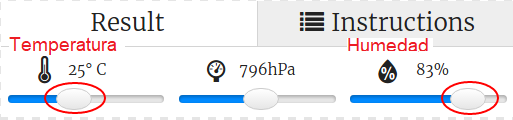

## Introducción:

En este proyecto, vas a utilizar los sensores de temperatura y humedad del Sense HAT para predecir cuándo hay una buena posibilidad de ver un arco iris. Cuando se detecten las condiciones adecuadas, se mostrará un arco iris en la matriz LED del Sense HAT.

  <iframe src="https://trinket.io/embed/python/eaea4cb76c?outputOnly=true&start=result" width="600" height="500" frameborder="0" marginwidth="0" marginheight="0" allowfullscreen mark="crwd-mark">
</iframe> 

En el emulador de Trinket se pueden mover los deslizadores para cambiar la temperatura y la humedad, viéndose así:

Tendrás un arco iris si la temperatura supera los 20 grados centígrados y la humedad supera el 80 por ciento. Trata de experimentar para encontrar las condiciones meteorológicas para el sol (amarillo) y la nieve (blanco).

### Información adicional para líderes de los clubes

Si necesitas imprimir este proyecto, usa la [versión para imprimir](https://projects.raspberrypi.org/en/projects/rainbow-predictor/print).

## \--- collapse \---

## title: Notas para líderes de los clubes

## Introducción:

En este proyecto, los niños aprenderán cómo usar los sensores Sense HAT para detectar el clima y mostrar un arco iris usando la matriz LED cuando hace calor y humedad.

## Recursos en línea

**Este proyecto usa Python 3.** Recomendamos el uso de [Trinket](https://trinket.io/) para escribir Python en línea. Este proyecto contiene los siguientes Trinkets:

* [Trinket inicial: 'Pronosticador de arco iris' -- jumpto.cc/rainbow-go](http://jumpto.cc/rainbow-go)

También hay un Trinket que contiene el proyecto completo:

* [‘Rainbow Predictor’ Finished -- trinket.io/python/eaea4cb76c](https://trinket.io/python/eaea4cb76c)

## Offline Resources

This project can also be [completed offline](https://www.codeclubprojects.org/en-GB/resources/physical-sense-hat/) on a Raspberry Pi computer with a Sense HAT. You can access the project resources by clicking the 'Project Materials' link for this project. This link contains a 'Project Resources' section, which includes resources that children will need to complete this project offline. Make sure that each child has access to a copy of these resources. This section includes the following files:

* rainbow/rainbow.py

You can also find a completed version of this project in the 'Volunteer Resources' section, which contains:

* rainbow-finished/rainbow.py

(All of the resources above are also downloadable as project and volunteer `.zip` files.)

## Learning Objectives

* Physical computing - sensors;
* Boolean AND; 
* RGB Colours;
* Sense HAT display;

This project covers elements from the following strands of the [Raspberry Pi Digital Making Curriculum](http://rpf.io/curriculum):

* [Combine programming constructs to solve a problem.](https://www.raspberrypi.org/curriculum/programming/builder)

## Challenges

* More Weather - display different images under different weather conditions. 

\--- /collapse \---

## \--- collapse \---

## title: Project materials

## Project resources

* [.zip file containing all project resources](resources/rainbow-project-resources.zip)
* [Starter project](http://jumpto.cc/rainbow-go)
* [Offline starter Python file](resources/rainbow-rainbow.py)

## Club leader resources

* [.zip file containing all completed project resources](resources/rainbow-volunteer-resources.zip)
* [Online completed Trinket project](https://trinket.io/python/eaea4cb76c)
* [rainbow-finished/rainbow.py](resources/rainbow-final-rainbow.py)

\--- /collapse \---