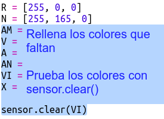

## Dibujando un arco iris

Primero vamos a dibujar un arco iris usando la matriz LED del Sense HAT. Los colores son rojo, naranja, amarillo, verde, azul, añil y violeta.

Para establecer el color de un LED determinado, necesitamos decir qué cantidad de rojo, verde y azul debería tener de 0 a 255.

+ Abre el Trinket inicial del Pronosticador de arco iris: <a href="http://jumpto.cc/rainbow-go" target="_blank">jumpto.cc/rainbow-go</a>.
    
    **El código para configurar Sense HAT se ha incluido para ti.**

+ Añade el código resaltado para configurar una variable para el color rojo y luego pon todos los píxeles en rojo usando `sensor.clear(R)`:
    
    
    
    Asegúrate de usar una letra mayúscula `R`.

+ El naranja es el siguiente. El naranja es rojo mezclado con verde. Puedes ajustar los números hasta obtener una naranja que te guste. Utiliza `sensor.clear(N)` esta vez para probar el nuevo color, asegurándote de usar una letra `N` mayúscula entre los paréntesis.
    
    

+ Ahora añade las variables `AM`, `V`, `A`, `AN`, `V` para que tengas los siete colores del arco iris. Puedes ver otros colores RGB (RVA (Rojo, Verde, Azul)) en <a href="http://jumpto.cc/colours" target="_blank">jumpto.cc/colours</a>
    
    Puedes probar tus colores usando `sensor.clear()`.
    
    

+ Añade una variable `X` para desactivar los píxeles (ni rojo, ni verde ni azul):
    
    

+ Ahora es el momento de dibujar un arco iris. Necesitas configurar una lista que contenga el color de cada píxel y luego llamar a `set_pixels` con la lista de colores. Para ahorrarte tener que teclearlo entero, puedes copiar el arco iris de `snippets.py` en tu proyecto.
    
    