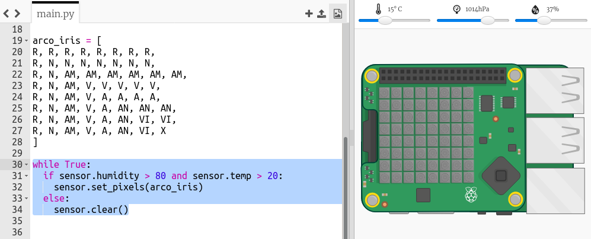

## Prediciendo un arco iris

Rainbows happen when the sun shines through water droplets at the right angle (usually in the afternoon). If it's warm and the humidity is high then it's worth checking to see if there's a rainbow.

+ Ahora solamente mostremos el arco iris si las condiciones son correctas. Cambia tu código para que se parezca a este:
    
    
    
    No puedes estar seguro de que haya un arco iris cuando se cumplen estas condiciones, pero vale la pena echar un vistazo.

+ Intenta cambiar los valores del deslizador hasta que veas el arco iris.
    
    
    
    Recuerda que los valores leídos por el programa no serán exactamente los mismos que los mostrados en los deslizadores.

+ Un *umbral* es un número que indica un cambio importante. 20 grados centígrados y un 80% de humedad son los umbrales para el detector de arco iris.
    
    Trata de cambiar los umbrales y luego mover los deslizadores para activar un arco iris.
    
    Si estás trabajando con un HAT Sense real entonces puedes probar tu código estableciendo los umbrales a valores bajos.