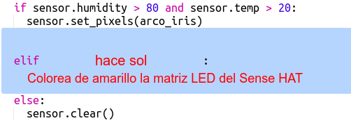

\--- challenge \---

## Reto: Más climas

¿Puedes mostrar una imagen del sol cuando la temperatura está por encima de 20 y la humedad está por debajo del 80%?

Consejo: Usa `elif` para comprobar otros tipos de clima. Por cada tipo de clima necesitarás incluir una condición para comprobar si se está dando y luego tendrás programar la visualización en el Sense HAT.

Consejo: Puedes crear un sol sencillo poniendo todos los píxeles en amarillo con `clear()`. O puedes intentar crear una imagen a base de píxeles como hiciste con el arco iris.

¿Qué tal una imagen de nieve si la humedad es superior al 80% y la temperatura es inferior a cero?

Consejo: Establece rojo, verde y azul a 255, el máximo, para crear blanco.

\--- /challenge \---