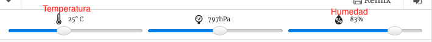

## Introducción:

En este proyecto, vas a utilizar los sensores de temperatura y humedad del Sense HAT para predecir cuando hay una buena posibilidad de ver un arcoíris. Cuando se detecten las condiciones adecuadas, se mostrará un arcoíris en la matriz LED del Sense HAT.

  <iframe src="https://trinket.io/embed/python/eaea4cb76c?outputOnly=true&start=result" width="600" height="500" frameborder="0" marginwidth="0" marginheight="0" allowfullscreen mark="crwd-mark">
</iframe> 

En el emulador de Trinket se pueden mover los deslizadores para cambiar la temperatura y la humedad, viéndose así:

Tendrás un arcoíris si la temperatura supera los 20 grados Centígrados y la humedad supera el 80 por ciento. Trata de experimentar para encontrar las condiciones meteorológicas para el sol (amarillo) y la nieve (blanco).

### Información adicional para los líderes del club

Si necesitas imprimir este proyecto, usa la [versión para imprimir](https://projects.raspberrypi.org/en/projects/rainbow-predictor/print).

## \--- collapse \---

## title: Notas para el líder del club

## Introducción:

En este proyecto, los niños aprenderán cómo usar los sensores Sense HAT para detectar el clima y mostrar un arcoíris usando la matriz LED cuando hace calor y hay humedad.

## Recursos en línea

**Este proyecto usa Python 3.** Recomendamos el uso de [Trinket](https://trinket.io/) para escribir Python en línea. Este proyecto contiene los Trinkets siguientes:

* [Trinket inicial 'Predictor de Arcoíris' -- jumpto.cc/rainbow-go](http://jumpto.cc/rainbow-go)

También hay un Trinket que contiene el proyecto completo:

* [‘Predictor de Arcoíris’ Terminado -- trinket.io/python/eaea4cb76c](https://trinket.io/python/eaea4cb76c)

## Recursos sin conexión

Este proyecto también se puede [completar sin conexión](https://www.codeclubprojects.org/en-GB/resources/physical-sense-hat/) en una computadora Raspberry Pi con un Sense HAT. Puedes acceder a los recursos del proyecto haciendo clic en el enlace «Materiales del proyecto» para este proyecto. Este enlace contiene una sección de «Recursos del proyecto», que incluye los recursos que los niños necesitarán para completar este proyecto sin conexión. Asegúrate de que cada niño tenga acceso a una copia de estos recursos. Esta sección incluye los siguientes archivos:

* rainbow/rainbow.py

También se puede encontrar una versión completa de este proyecto en la sección 'Recursos para voluntarios', que contiene:

* rainbow-finished/rainbow.py

(Todos los recursos anteriores también se pueden descargar como archivos `.zip` de proyectos y para voluntarios.)

## Objetivos del Aprendizaje

* Computación física - sensores;
* Booleano AND; 
* Colores RGB;
* Pantalla Sense HAT;

Este proyecto trata elementos de los siguientes aspectos del [Currículo de creación digital de Raspberry Pi](http://rpf.io/curriculum):

* [Combinar estructuras de programación para resolver un problema.](https://www.raspberrypi.org/curriculum/programming/builder)

## Desafíos

* Más clima - mostrar diferentes imágenes bajo diferentes condiciones meteorológicas. 

\--- /collapse \---

## \--- collapse \---

## title: Materiales del proyecto

## Recursos del proyecto

* [Starter project](http://jumpto.cc/rainbow-go)
* [Offline starter Python file](resources/rainbow-rainbow.py)

## Recursos para los líderes del club

* [Online completed Trinket project](https://trinket.io/python/eaea4cb76c)
* [rainbow-finished/rainbow.py](resources/rainbow-final-rainbow.py)

\--- /collapse \---