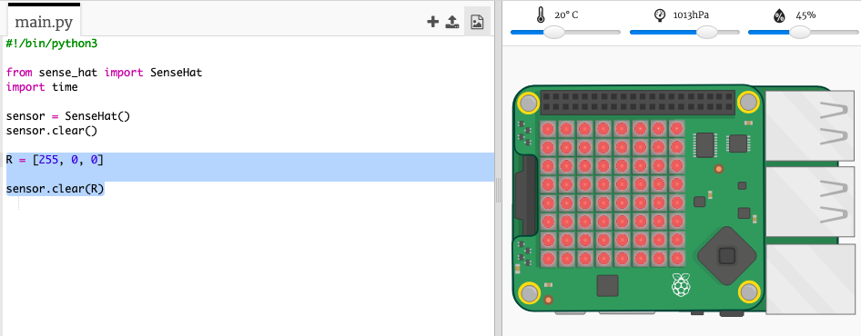
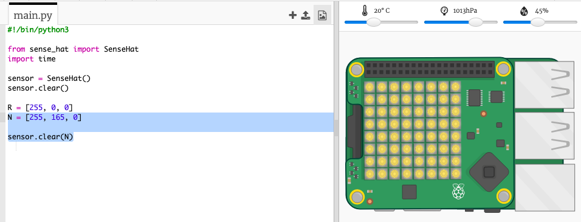
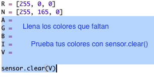
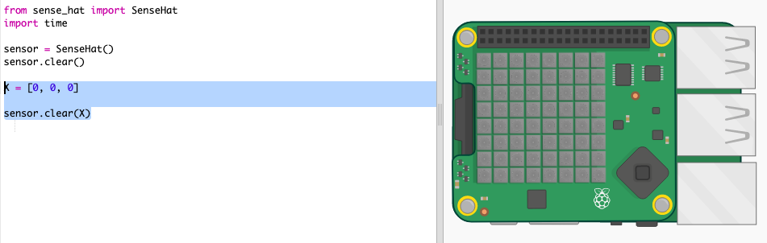
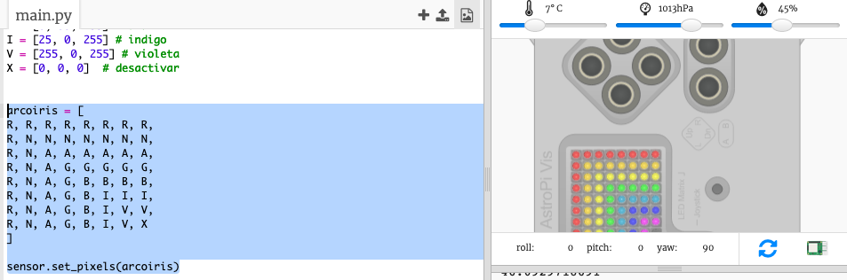

## Dibujando un arcoíris

Primero dibujemos un arcoíris usando la matriz de LED en el Sense HAT. Los colores son rojo, naranja, amarillo, verde, azul, añil y violeta.

Para establecer el color de un LED individual, necesitamos decir qué cantidad de rojo, verde y azul debería tener entre 0 a 255.

+ Abre el Trinket de inicio del Predictor de Arcoíris: <a href="https://trinket.io/python/69787e1e1d" target="_blank">trinket.io/python/69787e1e1d</a>.
    
    **El código para configurar Sense HAT ha sido incluído para ti.**

+ Agrega el código resaltado para configurar una variable para el color Rojo y luego pon todos los píxeles en rojo usando ` sensor.clear (R) `:
    
    
    
    Asegúrate de usar una letra mayúscula `R`.

+ El Naranja es el siguiente. El naranja es rojo mezclado con verde. Puedes ajustar los números hasta obtener un naranja que te guste. Utiliza ` sensor.clear(N) ` esta vez para probar el nuevo color, asegurándote de usar una letra mayúscula `N` entre los paréntesis.
    
    

+ Ahora agrega las variables `A`, `G`, `B`, `I`, `V` (nota: amarillo, verde, azul, índigo y violeta) para que tengas los siete colores del arcoíris. Puedes ver colores RGB en <a href="http://jumpto.cc/colours" target="_blank">jumpto.cc/colours</a>
    
    Puedes probar tus colores usando `sensor.clear()`.
    
    

+ Añade una variable `X` para desactivar los píxeles (no rojo, ni verde ni azul):
    
    

+ Ahora es el momento de dibujar un arcoíris. Necesitas configurar una lista que contenga el color de cada píxel y luego llamar a `set_pixels` con la lista de colores. Para ahorrarte el tecleo, puedes copiar el arcoíris de `snippets.py` en tu proyecto.
    
    