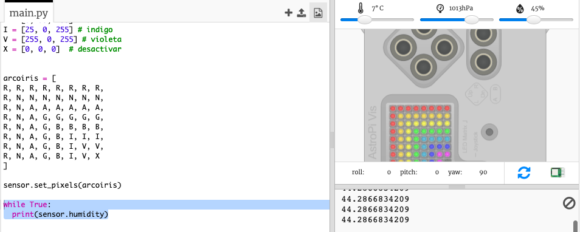

## Leyendo los datos del sensor

El Sense HAT tiene una gama de sensores que proporcionan datos reales en un ordenador Raspberry Pi. El emulador Sense HAT en Trinket te permite escribir y probar proyectos para el Sense HAT en tu navegador web.

El sensor de humedad indica la cantidad de humedad en el aire. La humedad es alta cuando llueve.

+ Leamos el sensor de humedad e imprimamos el resultado. Añade el código resaltado a la parte inferior de tu script.
    
    

+ Prueba tu programa moviendo el deslizador de humedad a diferentes valores.
    
    
    
    Ten en cuenta que el valor que obtienes del sensor de humedad no es exactamente el mismo que el valor del deslizador. Esto se debe a que los sensores no son perfectamente precisos.