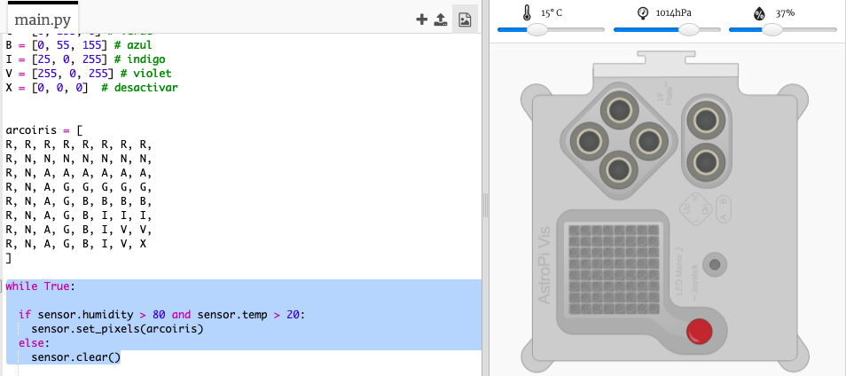

## Prediciendo un arcoíris

Rainbows happen when the sun shines through water droplets at the right angle (usually in the afternoon). If it's warm and the humidity is high then it's worth checking to see if there's a rainbow.

+ Ahora solamente mostremos el arcoíris si las condiciones son correctas. Cambia tu código para que se vea así:
    
    
    
    No puedes estar seguro de que haya un arcoíris cuando se cumplen estas condiciones, pero vale la pena echarle un vistazo.

+ Intenta cambiar los valores del deslizador hasta que veas el arco iris.
    
    
    
    Recuerda que los valores reportados no serán exactamente los mismos que los mostrados en los deslizadores.

+ Un *umbral* es un número que indica un cambio importante. 20 grados Centígrados y 80% de humedad son los umbrales para el detector de arcoíris.
    
    Trata de cambiar los umbrales y luego mover los deslizadores para activar un arcoíris.
    
    Si estás trabajando con un Sense HAT real, puedes probar tu código estableciendo los umbrales a valores bajos.