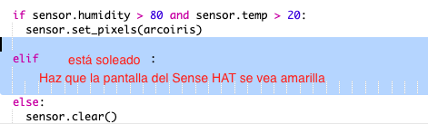

\--- challenge \---

## Desafío: Más Clima

Can you display a sun image when the temperature is above 20 and the humidity is below 80%?

Consejo: usa `elif` para comprobar otros tipos de clima. Por cada tipo de clima necesitarás incluir una condición para comprobar si hay ese tipo de clima y luego programar la visualización en el Sense HAT.

Consejo: Puedes crear un sol sencillo ajustando todos los píxeles a amarillo con `clear()`. O puede intentar crear una imagen de píxeles como lo hiciste con el arcoíris.

How about a snow image if the humidity is above 80% and the temperature is below zero?

Consejo: Establece rojo, verde y azul a 255, el máximo, para crear blanco.

\--- /challenge \---