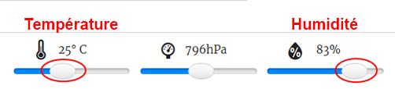

## Introduction :

Dans ce projet, tu utiliseras les capteurs de température et d'humidité du Sense HAT pour prédire quand il y a de bonnes chances de repérer un arc-en-ciel. Lorsque les bonnes conditions sont détectées, tu afficheras un arc-en-ciel sur la matrice LED Sense HAT.

  <iframe src="https://trinket.io/embed/python/eaea4cb76c?outputOnly=true&start=result" width="600" height="500" frameborder="0" marginwidth="0" marginheight="0" allowfullscreen>
</iframe> 

Dans l'émulateur Trinket, tu peux déplacer les curseurs pour changer la température et l'humidité, ils ressemblent à ceci :

Tu obtiendras un arc-en-ciel si la température est supérieure à 20 degrés Celsius et que l'humidité est supérieure à 80 pourcents. Essaie d'expérimenter pour trouver les conditions météorologiques pour le soleil (jaune) et la neige (blanche).

### Informations complémentaires pour les responsables de club

Si vous avez besoin d'imprimer ce projet, merci d'utiliser la [version imprimable](https://projects.raspberrypi.org/en/projects/rainbow-predictor/print).

## \--- collapse \---

## title: Notes pour le responsable de club

## Introduction :

Dans ce projet, les enfants apprendront à utiliser les capteurs Sense HAT pour détecter la météo, et afficher un arc-en-ciel en utilisant la matrice LED quand il fait chaud et humide.

## Ressources en ligne

**Ce projet utilise Python 3.** Nous vous recommandons d'utiliser [Trinket](https://trinket.io/) pour écrire du code Python en ligne. Ce projet contient les Trinkets suivants :

* [Trinket de démarrage « Prédicteur d'arc-en-ciel » -- jumpto.cc/rainbow-go](http://jumpto.cc/rainbow-go)

Il existe aussi ce trinket qui contient le projet terminé :

* [« Prédicteur d'arc-en-ciel » terminé -- trinket.io/python/eaea4cb76c](https://trinket.io/python/eaea4cb76c)

## Ressources hors-ligne

Ce projet peut également être [terminé hors-ligne](https://www.codeclubprojects.org/en-GB/resources/physical-sense-hat/) sur un ordinateur Raspberry Pi avec un Sense HAT. Vous pouvez accéder aux ressources du projet en cliquant sur le lien « Matériaux du projet ». Ce lien contient une section « Ressources du projet » qui inclut les ressources dont les enfants auront besoin pour compléter le projet hors-ligne. Assurez-vous que les enfants ont accès à une copie de ces ressources. Cette section inclut les fichiers suivants :

* rainbow/rainbow.py

Vous pouvez aussi trouver une version complétée du projet dans la section « Ressources du bénévole » qui contient :

* rainbow-finished/rainbow.py

(Toutes les ressources ci-dessus peuvent aussi être téléchargées dans les fichiers`.zip` projet et bénévole)

## Objectifs d'apprentissage

* Informatique physique - les capteurs ;
* Booléen ET ; 
* Les couleurs RVB ;
* Affichage Sense HAT ;

Ce projet couvre les éléments suivants du [Programme de Créativité Numérique de Raspberry Pi](https://rpf.io/curriculum) :

* [Combiner des constructions de programmation pour résoudre un problème.](https://www.raspberrypi.org/curriculum/programming/builder)

## Défis

* Plus de Météo - afficher différentes images sous différentes conditions météorologiques. 

\--- /collapse \---

## \--- collapse \---

## title: Matériaux du projet

## Ressources du projet

* [Projet de démarrage](http://jumpto.cc/rainbow-go)
* [Fichier Python de démarrage hors ligne](resources/rainbow-rainbow.py)

## Ressources pour le responsable de club

* [Trinket Python en-ligne completé](https://trinket.io/python/eaea4cb76c)
* [rainbow-finished/rainbow.py](resources/rainbow-final-rainbow.py)

\--- /collapse \---