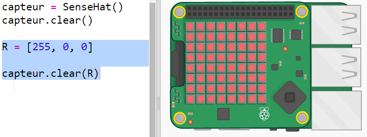
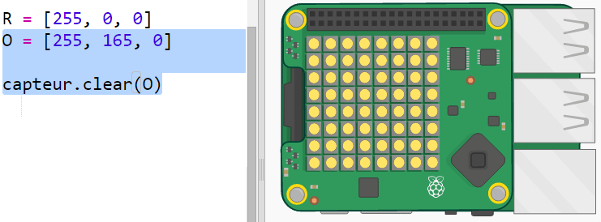
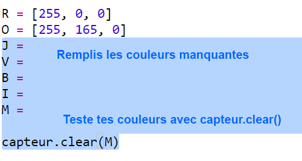
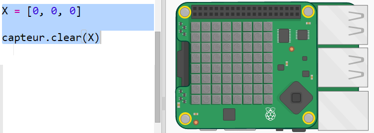
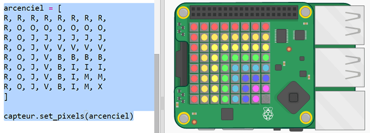

## Dessiner un arc-en-ciel

Commençons par dessiner un arc-en-ciel en utilisant la matrice LED sur le Sense HAT. Les couleurs sont Rouge, Orange, Jaune, Vert, Bleu, Indigo et Mauve.

Pour définir la couleur d'une LED individuelle, nous devons dire combien de rouge, vert et bleu elle doit avoir de 0 à 255.

+ Ouvre le Trinket de démarrage « Prédicteur d'arc-en-ciel » : <a href="http://jumpto.cc/rainbow-go" target="_blank">jumpto.cc/rainbow-go</a>.
    
    **Le code de configuration du Sense HAT a été inclus pour toi.**

+ Ajoute le code surligné pour configurer une variable pour la couleur rouge, puis tourne tous les pixels en rouge en utilisant `sense.clear(R)` :
    
    
    
    Assure-toi d'utiliser une lettre majuscule `R`.

+ L'orange est le suivant. L'orange est du rouge mélangé au vert. Tu peux ajuster les nombres jusqu'à ce que tu obtiennes un orange que tu aimes. Utilise `sense.clear(O)` cette fois pour tester la nouvelle couleur, assure-toi d'utiliser une lettre majuscule `O` entre parenthèses.
    
    

+ Maintenant, ajoute des variables `J`, `V`, `B`, `I`, `M` pour que tu aies les sept couleurs de l'arc-en-ciel. Tu peux consulter les couleurs RVB sur <a href="http://jumpto.cc/colours" target="_blank">jumpto.cc/colours</a>
    
    Tu peux tester tes couleurs en utilisant `sense.clear()`.
    
    

+ Ajoute une variable `X` pour régler les pixels à éteint (sans rouge, vert ou bleu) :
    
    

+ Maintenant il est temps de dessiner un arc-en-ciel. Tu dois configurer une liste contenant la couleur de chaque pixel puis appeler `set_pixels` avec la liste des couleurs. Pour enregistrer la saisie, tu peux copier l'arc-en-ciel de `snippets.py` dans ton projet.
    
    