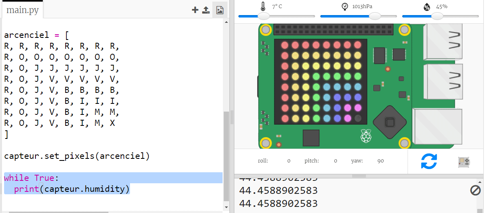

## Lecture des données du capteur

Le Sense HAT a une gamme de capteurs qui fournissent des données réelles sur un ordinateur Raspberry Pi. L'émulateur Sense HAT dans Trinket te permet d'écrire et de tester des projets pour le Sense HAT dans ton navigateur web.

Le capteur d'humidité indique la quantité d'humidité dans l'air. L'humidité est élevée quand il pleut.

+ Lisons à partir du capteur d'humidité et imprimons le résultat. Ajoute le code surligné au bas de ton script.
    
    

+ Teste ton programme en déplaçant le curseur d'humidité vers des valeurs différentes.
    
    
    
    Note que la valeur que tu obtiens du capteur d'humidité n'est pas exactement la même que celle du curseur. Cela est dû au fait que les capteurs ne sont pas parfaitement précis.