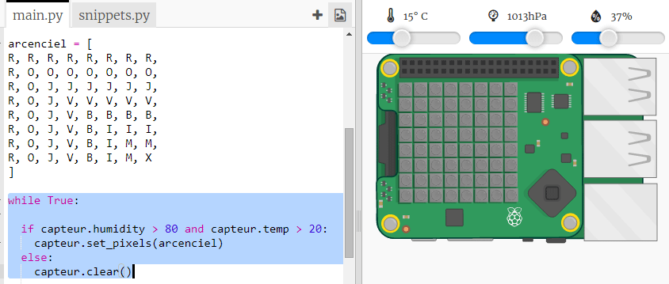

## Prédire un arc-en-ciel

Les arcs-en-ciel se produisent lorsque le soleil brille à travers des gouttelettes d'eau à angle droit (généralement l'après-midi). S'il fait chaud et que l'humidité est élevée, cela vaut la peine de vérifier s'il y a un arc-en-ciel.

+ Maintenant, ne montrons l'arc-en-ciel que si les conditions sont correctes. Change ton code pour ressembler à ceci :
    
    
    
    Tu ne peux pas être sûr qu'il y ait un arc-en-ciel quand ces conditions sont remplies, mais cela vaut la peine d'y jeter un coup d’œil.

+ Essaie de changer les valeurs sur le curseur jusqu'à ce que tu vois l'arc-en-ciel.
    
    
    
    Rappelle-toi que les valeurs rapportées ne seront pas exactement les mêmes que celles affichées sur les curseurs.

+ Un *seuil* est un nombre qui indique un changement important. 20 degrés Celsius et 80% d'humidité sont des seuils pour le détecteur d'arc-en-ciel.
    
    Essaie de changer les seuils puis de déplacer les curseurs pour déclencher un arc-en-ciel.
    
    Si tu travailles avec un Sense HAT physique, tu peux tester ton code en définissant les seuils à des valeurs faibles.