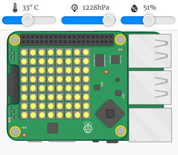

\--- challenge \---

## Défi : Plus de Météo

Peux-tu afficher une image du soleil lorsque la température est supérieure à 20 et que l'humidité est inférieure à 80%.

Astuce : Utilise `elif` pour vérifier s'il y a d'autres types de météo. Pour chaque type de météo, tu devras inclure une condition pour vérifier un type de météo, puis code pour définir l'affichage sur le Sense HAT.

Astuce : Tu peux créer un simple soleil en mettant tous les pixels en jaune avec `clear()`. Ou tu peux essayer de créer une image en pixel comme tu l'as fait avec l'arc-en-ciel.

Que dirais-tu d'une image de neige si l'humidité est supérieure à 80% et que la température est inférieure à zéro.

Astuce : Définis le rouge, le vert et le bleu au maximum 255 pour créer du blanc.

\--- /challenge \---