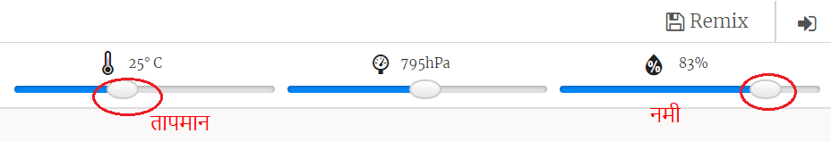

## परिचय:

इस प्रोजेक्ट में आप Sense HAT पर तापमान और नमी सेंसर का उपयोग यह पूर्वानुमान लगाने के लिए करेंगे कि इंद्रधनुष को देखने का अच्छा मौका कब है। जब सही परिस्थितियों का पता चल जाता है तो आप Sense HAT LED मैट्रिक्स पर इंद्रधनुष प्रदर्शित करेंगे।

  <iframe src="https://trinket.io/embed/python/eaea4cb76c?outputOnly=true&start=result" width="600" height="500" frameborder="0" marginwidth="0" marginheight="0" allowfullscreen mark="crwd-mark">
</iframe> 

Trinket एमुलेटर में आप तापमान और नमी बदलने के लिए स्लाइडर्स को चला सकते हैं| वे इस तरह दिखते हैं:

आपको इंद्रधनुष तब मिलेगा जब तापमान 20 डिग्री सेल्सियस से अधिक होगा और नमी 80 प्रतिशत से अधिक होगी। धूप (पीला) और बर्फ (सफेद) के लिए मौसम की स्थितियों का पता लगाने के लिए प्रयोग करते रहें।

### क्लब लीडरों के लिए अतिरिक्त जानकारी

यदि आप इस प्रोजेक्ट को प्रिंट करना चाहते हैं, तो कृपया [प्रिंटर अनुकूल संस्करण](https://projects.raspberrypi.org/en/projects/rainbow-predictor/print) का उपयोग करें।

## \--- collapse \---

## title: क्लब लीडर नोट्स

## परिचय:

इस प्रोजेक्ट में बच्चे सीखेंगे कि मौसम का पता लगाने के लिए Sense HAT सेंसरों का उपयोग कैसे करें और इसके गर्म और नम होने पर LED मैट्रिक्स का उपयोग करके इंद्रधनुष कैसे प्रदर्शित करें।

## ऑनलाइन संसाधन

**इस प्रोजेक्ट में Python 3 का उपयोग किया जाता है।** Python को ऑनलाइन लिखने के लिए हम [Trinket](https://trinket.io/) का उपयोग करने की सलाह देते हैं। इस प्रोजेक्ट में निम्नलिखित Trinket हैं:

* ['इंद्रधनुष पूर्वानुमान संकेतक' स्टार्टर Trinket -- jumpto.cc/rainbow-go](http://jumpto.cc/rainbow-go)

एक ऐसा trinket भी है जिसमें पूर्ण किया गया प्रोजेक्ट है:

* ['इंद्रधनुष पूर्वानुमान संकेतक' समाप्त - trinket.io/python/eaea4cb76c](https://trinket.io/python/eaea4cb76c)

## ऑफ़लाइन संसाधन

इस प्रोजेक्ट को Sense HAT से किसी Raspberry Pi कंप्यूटर पर [ऑफ़लाइन भी पूरा किया जा सकता है](https://www.codeclubprojects.org/en-GB/resources/physical-sense-hat/)। आप इस प्रोजेक्ट के लिए 'प्रोजेक्ट सामग्री' लिंक पर क्लिक करके प्रोजेक्ट के संसाधनों को पा सकते हैं। इस लिंक में 'प्रोजेक्ट संसाधन' खंड है जिसमें ऐसे संसाधन हैं जिसकी बच्चों को इस प्रोजेक्ट को ऑफ़लाइन पूरा करने के लिए ज़रूरत होगी। सुनिश्चित करें कि प्रत्येक बच्चे के पास इन संसाधनों की एक कापी हो। इस खंड में निम्नलिखित फाइलें शामिल हैं:

* rainbow/rainbow.py

आपको 'वालंटियर संसाधन' खंड में इस प्रोजेक्ट का पूर्ण किया गया संस्करण भी मिल सकता है, जिसमें निम्न शामिल हैं:

* rainbow-finished/rainbow.py

(उपर्युक्त सभी संसाधन प्रोजेक्ट और वालंटियर`.zip` फ़ाइलों के रूप में भी डाउनलोड किए जा सकते हैं।)

## सीखने के उद्देश्य

* भौतिक कंप्यूटिंग - सेंसर;
* बूलियन और; 
* RGB रंग;
* Sense HAT डिस्प्ले;

This project covers elements from the following strands of the [Raspberry Pi Digital Making Curriculum](https://rpf.io/curriculum):

* [किसी समस्या को हल करने के लिए प्रोग्रामिंग संरचनाओं को जोड़ें।](https://www.raspberrypi.org/curriculum/programming/builder)

## चुनौतियाँ

* अन्य मौसम - मौसम की अलग-अलग परिस्थितियों में अलग-अलग चित्र प्रदर्शित करना। 

\--- /collapse \---

## \--- collapse \---

## title: प्रोजेक्ट सामग्री

## प्रोजेक्ट संसाधन

* [Starter project](http://jumpto.cc/rainbow-go)
* [Offline starter Python file](resources/rainbow-rainbow.py)

## क्लब लीडर संसाधन

* [Online completed Trinket project](https://trinket.io/python/eaea4cb76c)
* [rainbow-finished/rainbow.py](resources/rainbow-final-rainbow.py)

\--- /collapse \---