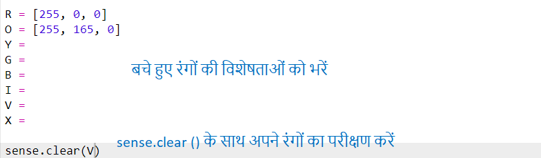
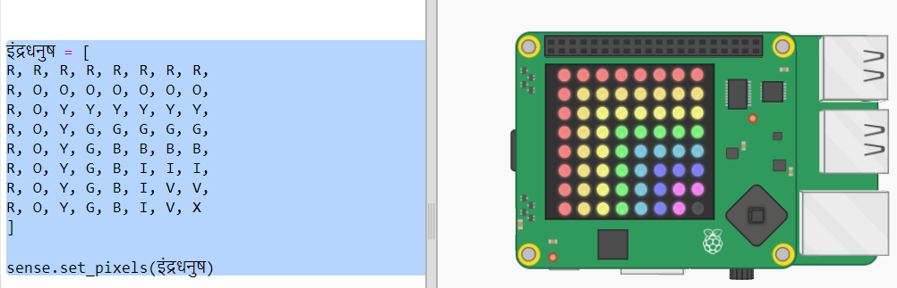

## इंद्रधनुष बनाना

आइए पहले Sense HAT पर LED मैट्रिक्स का उपयोग करके इंद्रधनुष बनाएँ। इसमें लाल, नारंगी, पीला, हरा, नीला, इंडिगो और वायलेट रंग हैं।

किसी एक LED का रंग सेट करने के लिए हमें यह बताना होगा कि यह 0 से 255 तक कितना लाल, हरा और नीला होना चाहिए।

+ इंद्रधनुष पूर्वानुमान संकेतक Trinket को खोलें: <a href="http://jumpto.cc/rainbow-go" target="_blank">jumpto.cc/rainbow-go</a>।
    
    **आपके लिए Sense HAT को सेट अप करने का कोड शामिल किया गया है।**

+ लाल रंग के लिए वेरिएबल (variable) सेट करने के लिए हाइलाइट किए गए कोड को जोड़ें और फिर `sense.clear(R)` का उपयोग करके सभी पिक्सेल को लाल करें:
    
    
    
    सुनिश्चित करें कि आप बड़े अक्षर `R` का उपयोग करते हैं।

+ अगला रंग नारंगी है। नारंगी रंग में लाल रंग हरे रंग के साथ मिश्रित होता है। आप संख्याओं को तब तक बदल सकते हैं जब तक आपको अपनी पसंद का नारंगी रंग न मिल जाए। नए रंग का परीक्षण करने के लिए इस बार `sense.clear(O)` का उपयोग करें| यह सुनिश्चित करें कि आप कोष्ठक में बड़े अक्षर `O` का उपयोग करते हैं।
    
    

+ अब वेरिएबल `Y`, `G`, `B`, `I`, `V` जोड़ें ताकि आपके पास इंद्रधनुष के सात रंग हों। आप <a href="http://jumpto.cc/colours" target="_blank">jumpto.cc/colours</a> पर RGB रंग देख सकते हैं।
    
    आप `sense.clear()` का उपयोग करके अपने रंगों का परीक्षण कर सकते हैं।
    
    

+ पिक्सेल ऑफ करने के लिए वेरिएबल `X` जोड़ें (कोई लाल, हरा या नीला नहीं):
    
    

+ अब इंद्रधनुष बनाने का समय आ गया है। आपको एक सूची तैयार करनी होगी जिसमें प्रत्येक पिक्सेल का रंग होगा और फिर `set_pixels` को रंगों की सूची के साथ कॉल करें | टाइपिंग से बचने के लिए आप अपने प्रोजेक्ट में इंद्रधनुष को `snippets.py` से कॉपी कर सकते हैं।
    
    