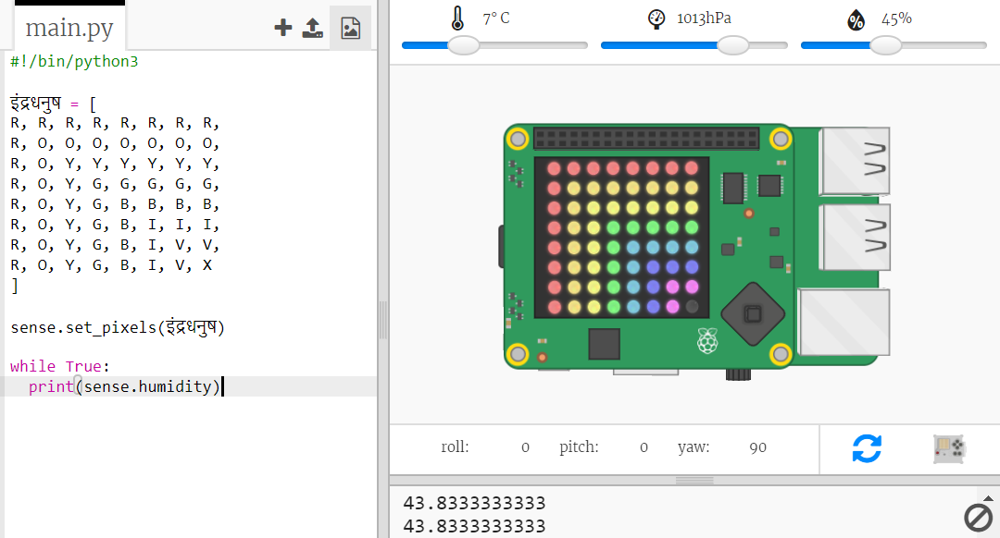

## सेंसर डेटा पढ़ना

Sense HAT में कई सेंसर होते हैं जो Raspberry Pi कंप्यूटर पर वास्तविक डेटा प्रदान करते हैं। Trinket में Sense HAT एमुलेटर से आप अपने वेब ब्राउज़र में Sense HAT के लिए प्रोजेक्ट लिख सकते हैं और उनका परीक्षण कर सकते हैं।

नमी सेंसर हवा में नमी की मात्रा सूचित करता है। बारिश होने पर नमी अधिक होती है।

+ आइए हम नमी सेंसर से पढ़ें और परिणाम का प्रिंट आउट लें। अपनी स्क्रिप्ट के नीचे हाइलाइट किया गया कोड जोड़ें।
    
    

+ नमी स्लाइडर को विभिन्न मूल्य पर ले जाकर अपने प्रोग्राम का परीक्षण करें।
    
    
    
    ध्यान दें कि नमी सेंसर से आपको जो संख्या मिलती है वह स्लाइडर पर दिए गए संख्या के बराबर नहीं होता है। ऐसा इसलिए है क्योंकि सेंसर पूरी तरह से सही नहीं होते हैं।