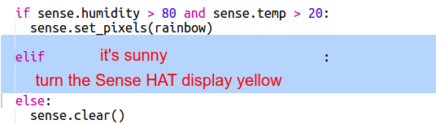

\--- challenge \---

## चुनौती: अन्य मौसम

जब तापमान 20 से ऊपर हो और नमी 80% से नीचे हो तो क्या आप सूर्य की छवि प्रदर्शित कर सकते हैं।

सुझाव: अन्य प्रकार के मौसमों की जाँच करने के लिए `elif` का उपयोग करें। प्रत्येक प्रकार के मौसम के लिए आपको एक शर्त शामिल करनी होगी और फिर Sense HAT पर डिस्प्ले सेट करने के लिए कोड शामिल करना होगा।

सुझाव: आप `clear()` से सभी पिक्सेल को पीले रंग में सेट करके एक सामान्य सूर्य बना सकते हैं। या जैसे आपने इंद्रधनुष के साथ किया, आप एक पिक्सेल छवि बनाने की कोशिश कर सकते हैं।

यदि नमी 80% से ऊपर हो और तापमान शून्य से नीचे हो तो बर्फ की छवि बनाना कैसा रहेगा।

सुझाव: सफेद रंग बनाने के लिए लाल, हरा और नीला रंग अधिकतम 255 पर सेट करें।

\--- /challenge \---