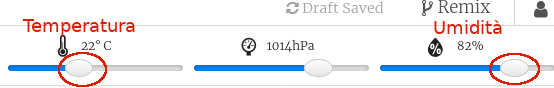

## Introduzione

In questo progetto utilizzerai i sensori di temperatura e umidità sul Sense HAT per prevedere quando c'è una buona probabilità di avvistare un arcobaleno. Quando verranno rilevate le giuste condizioni, verrà visualizzato un arcobaleno sulla matrice LED del Sense HAT.

  <iframe src="https://trinket.io/embed/python/eaea4cb76c?outputOnly=true&start=result" width="600" height="500" frameborder="0" marginwidth="0" marginheight="0" allowfullscreen mark="crwd-mark">
</iframe> 

Nell'emulatore Trinket è possibile spostare i cursori per modificare la temperatura e l'umidità:

Se la temperatura supera i 20 gradi Celsius e l'umidità supera l'80 per cento, verrà visualizzato un arcobaleno. Prova a sperimentare per trovare le condizioni meteorologiche per sole (giallo) e neve (bianco).

### Ulteriori informazioni per gli organizzatori dei club

Se intendete stampare questo progetto, cliccate su [Versione stampabile](https://projects.raspberrypi.org/it-IT/projects/rainbow-predictor/print).

--- collapse ---
---
title: Note per i volontari
---

## Introduzione:

In questo progetto, i bambini impareranno come utilizzare i sensori di Sense HAT per rilevare le condizioni meteorologiche e visualizzare un arcobaleno usando la matrice LED quando è caldo e umido.

## Risorse online

**Questo progetto utilizza Python 3.** Consigliamo di utilizzare [Trinket](https://trinket.io/) per scrivere in linguaggio Python online. Questo progetto contiene i seguenti Trinket:

* ['Predittore di arcobaleno' Progetto iniziale -- jumpto.cc/rainbow-go](http://jumpto.cc/rainbow-go)

C'è anche un trinket che contiene il progetto completo:

* ['Predittore di arcobaleno' Progetto completo -- trinket.io/python/158ad38522](https://trinket.io/python/158ad38522)

## Risorse offline

Questo progetto può anche essere [completato offline](https://www.codeclubprojects.org/en-GB/resources/physical-sense-hat/) su un computer Raspberry Pi con un Sense HAT. È possibile accedere alle risorse del progetto facendo click sul link "Materiali del progetto" relativo a questo progetto. Alla sezione "Risorse del progetto", sono raccolte le risorse necessarie ai bambini per completare il progetto offline. È bene assicurarsi che tutti i bambini abbiano accesso a una copia di queste risorse. Questa sezione contiene i seguenti file:

* rainbow/rainbow.py

Potete anche trovare una versione completa di questo progetto nella sezione 'Risorse per i volontari', che contiene:

* rainbow-finished/rainbow.py

(Tutte le risorse indicate possono essere scaricate anche come file `.zip` di progetto, anche per i volontari.)

## Obiettivi di apprendimento

* Physical computing - sensori;
* AND Booleano; 
* Colori RGB;
* Display del Sense HAT;

Questo progetto include elementi tratti dalle seguenti componenti del [Digital Making Curriculum di Raspberry Pi](https://rpf.io/curriculum):

* [Combinare i costrutti base di un linguaggio di programmazione per risolvere un problema.](https://www.raspberrypi.org/curriculum/programming/builder)

## Sfide

* Più condizioni meteo: visualizza immagini diverse in base a differenti condizioni meteorologiche. 

--- /collapse ---

--- collapse ---
---
title: Materiali del progetto
---

## Risorse del progetto

* [File .zip con tutte le risorse del progetto](resources/rainbow-project-resources.zip)
* [Progetto iniziale](http://jumpto.cc/rainbow-go)
* [File Python iniziale offline](resources/rainbow-rainbow.py)

## Risorse per gli organizzatori del club

* [File .zip con tutte le risorse del progetto completate](resources/rainbow-volunteer-resources.zip)
* [Trinket online del progetto completo](https://trinket.io/python/158ad38522)
* [rainbow-finished/rainbow.py](resources/rainbow-final-rainbow.py)

--- /collapse ---