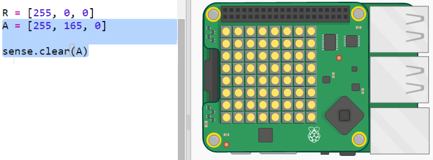
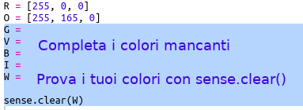
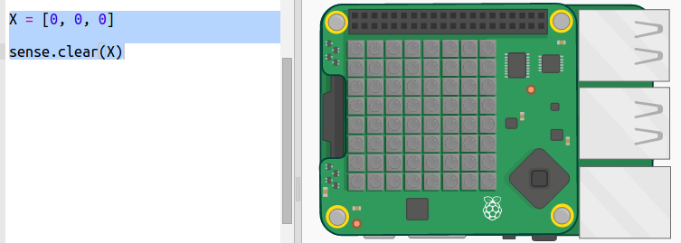
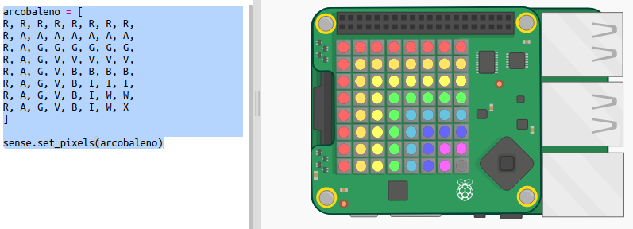

## Disegnare un arcobaleno

Per prima cosa disegniamo un arcobaleno usando la matrice LED sul Sense HAT. I colori sono rosso, arancione, giallo, verde, blu, indaco e viola.

Per impostare il colore di un singolo LED dobbiamo dire quanto rosso, verde e blu dovrebbe avere da 0 a 255.

+ Apri il trinket di partenza: <a href="http://jumpto.cc/rainbow-go" target="_blank">jumpto.cc/rainbow-go</a>.
    
    **Il codice per inizializzare il Sense HAT è stato incluso per te.**

+ Aggiungi il codice evidenziato per impostare una variabile per il colore rosso e poi fai diventare rossi tutti i pixel usando `sense.clear(R)`:
    
    
    
    Assicurati di utilizzare una lettera maiuscola `R`.

+ Il prossimo è l'arancione. L'arancione è rosso misto a verde. Puoi modificare i numeri finché non ottieni un arancione che ti piace. Usa `sense.clear(A)` questa volta per testare il nuovo colore, assicurandoti di utilizzare una lettera maiuscola `A` tra le parentesi.
    
    

+ Ora aggiungi le variabili `G`, `V`, `B`, `I`, `W` così da avere i 7 colori dell'arcobaleno. Puoi cercare i colori RGB su <a href="http://jumpto.cc/colours" target="_blank">jumpto.cc/colours</a>
    
    Puoi testare i tuoi colori usando `sense.clear()`.
    
    

+ Aggiungi una variabile `X` per spegnere i pixel (nessun rosso, verde o blu):
    
    

+ Adesso è il momento di disegnare un arcobaleno. Devi impostare una lista contenente il colore di ciascun pixel e poi chiamare `set_pixels` con l'elenco dei colori. Per scrivere meno puoi copiare l'arcobaleno da `snippets.py` nel tuo progetto.
    
    