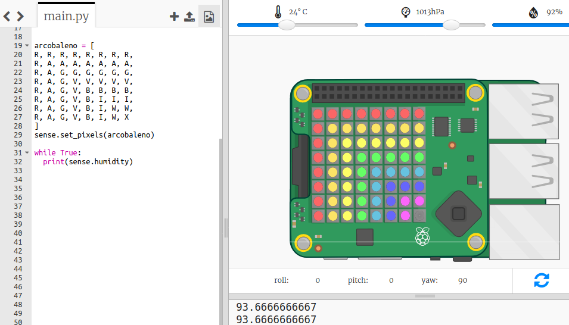

## Leggere i dati dai sensori

Il Sense HAT ha una serie di sensori che forniscono dati dal mondo reale su un computer Raspberry Pi. L'emulatore Sense HAT di Trinket ti consente di scrivere e testare progetti per il Sense HAT nel tuo browser web.

Il sensore di umidità riporta la quantità di umidità nell'aria. L'umidità è alta quando piove.

+ Leggiamo dal sensore di umidità e stampiamo il risultato. Aggiungi il codice evidenziato in fondo al tuo script.
    
    

+ Prova il tuo programma spostando il cursore dell'umidità su valori diversi.
    
    
    
    Osserva che il valore che si ottiene dal sensore di umidità non è esattamente uguale al valore sul cursore. Questo perché i sensori non sono infinitamente precisi.