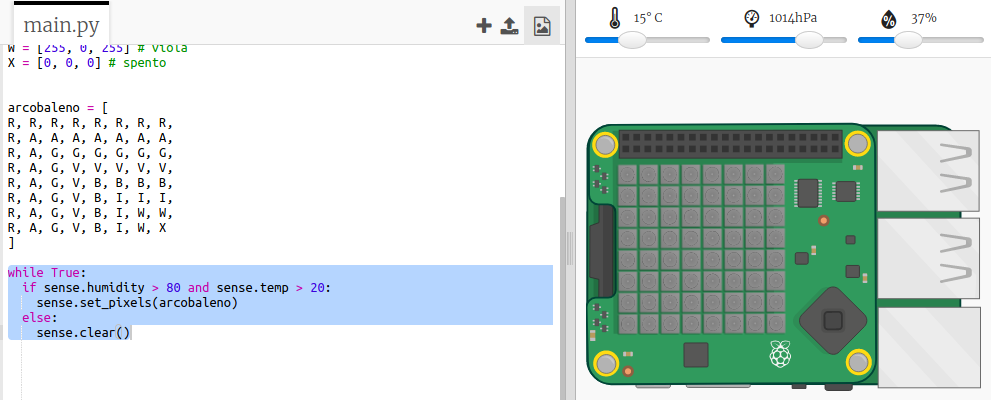

## Prevedere un arcobaleno

Gli arcobaleni si verificano quando il sole splende attraverso le goccioline d'acqua con la giusta inclinazione (di solito nel pomeriggio). Se fa caldo e l'umidità è alta vale la pena verificare se c'è un arcobaleno.

+ Mostriamo l'arcobaleno solo se le condizioni sono corrette. Modifica il tuo codice come segue:
    
    
    
    Non puoi essere sicuro che ci sia un arcobaleno quando queste condizioni sono soddisfatte, ma vale la pena dare un'occhiata.

+ Prova a cambiare i valori sul cursore finché non vedi l'arcobaleno.
    
    
    
    Ricorda che i valori riportati non saranno esattamente gli stessi mostrati sui cursori.

+ Una *soglia* è un numero che indica un cambiamento importante. 20 gradi C e l'80% di umidità sono soglie per il rivelatore arcobaleno.
    
    Prova a modificare le soglie e poi muovi i cursori per attivare un arcobaleno.
    
    Se stai lavorando con un vero Sense HAT, puoi testare il tuo codice impostando le soglie su valori bassi.