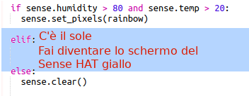

\--- challenge \---

## Sfida: più condizioni meteo

Can you display a sun image when the temperature is above 20 and the humidity is below 80%?

Suggerimento: usa `elif` per controllare la presenza di altre condizioni meteo. Per ogni condizione meteo dovrei aggiungere una condizione specifica e il relativo codice per impostare lo schermo sul Sense HAT.

Suggerimento: Puoi creare un sole semplice impostando tutti i pixel in giallo con `clear()`. Oppure puoi provare a creare un'immagine in pixel come hai fatto con l'arcobaleno.

How about a snow image if the humidity is above 80% and the temperature is below zero?

Suggerimento: Imposta il rosso, il verde e il blu al valore massimo di 255 per creare il bianco.

\--- /challenge \---