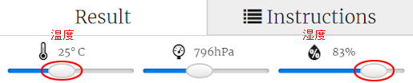

## はじめに

このプロジェクトでは、いつ虹（にじ）に出会えるかを予測するためにSense HAT上にある温度(おんど)センサーと湿度(しつど)センサーを使います。 適切な条件がそろったときにSense HAT LED Matrixに虹（にじ）を表示します。

  <iframe src="https://trinket.io/embed/python/eaea4cb76c?outputOnly=true&start=result" width="600" height="500" frameborder="0" marginwidth="0" marginheight="0" allowfullscreen mark="crwd-mark">
</iframe> 

Trinketエミュレータでは、以下のようにスライダーを動かして温度と湿度を変更できます。

気温が20度を超えて、かつ、湿度が80パーセントを超えると虹（にじ）が出ます。 晴れ（黄色）や雪（白）になる気象条件を見つける実験をしてみてください。

### クラブリーダーのための追加情報

このプロジェクトを印刷する必要がある場合は、 [印刷用バージョン](https://projects.raspberrypi.org/en/projects/rainbow-predictor/print)を使用してください。

## \--- collapse \---

## title: クラブリーダー用メモ

## はじめに

このプロジェクトでは、子どもたちがSense HATセンサーの使って天気を検知し、あたたかくて湿度が高いときにLEDマトリックスを使って虹（にじ）を表示する方法を学びます。

## オンライン・リソース

**このプロジェクトではPython 3を使います。**オンライン上でPythonを書ける[Trinket](https://trinket.io/)を使うことをおすすめします。 このプロジェクトでは、以下のTrinketが用意されています：

* [「虹（にじ）の予測」基本Trinket -- jumpto.cc/rainbow-go](http://jumpto.cc/rainbow-go)

また、完成版プログラムが入力済みのtrinketも用意されています。

* [「虹（にじ）の予測」完成 -- trinket.io/python/eaea4cb76c](https://trinket.io/python/eaea4cb76c)

## オフライン・リソース

このプロジェクトはSense HATをつけたRaspberry Piを使って[オフラインでも完了](https://www.codeclubprojects.org/en-GB/resources/physical-sense-hat/)できます。 「プロジェクト資料」のリンクをクリックすると、このプロジェクトのリソースにアクセスできます。 このリンクには「プロジェクト資料」のセクションがあり、子どもたちがこのプロジェクトをオフラインで完了するのに必要な資料が含まれています。 子どもたちがこれらの資料のコピーにアクセスできるか確認してください。 このセクションには以下のファイルを含みます：

* rainbow/rainbow.py

完成版プログラムは「ボランティア資料」からも入手可能で、以下が含まれています：

* rainbow-finished/rainbow.py

（上記の全リソースはプロジェクト用およびボランティア用に`.zip` ファイルとしてダウンロードできます。）

## 学習目標

* フィジカル・コンピューティング - センサー
* 論理積 
* RGBカラー
* Sense HATディスプレイ

このプロジェクトは [Raspberry Piデジタル・メイキング・カリキュラム](http://rpf.io/curriculum)の中から、以下の内容をあつかいます：

* [プログラミング構造を組み合わせて問題を解決する。](https://www.raspberrypi.org/curriculum/programming/builder)

## チャレンジ

* 天気の追加 - さまざまな気象条件でさまざまな画像を表示 

\--- /collapse \---

## \--- collapse \---

## title: プロジェクト資料

## プロジェクト資料

* [全プロジェクト・リソースの入った.zipファイル](resources/rainbow-project-resources.zip)
* [基本のプロジェクト](http://jumpto.cc/rainbow-go)
* [オフラインの基本Pythonファイル](resources/rainbow-rainbow.py)

## クラブ・リーダー向け資料

* [全プロジェクトの完成版リソースの入った.zipファイル](resources/rainbow-volunteer-resources.zip)
* [オンラインの完成版Trinketプロジェクト](https://trinket.io/python/eaea4cb76c)
* [rainbow-finished/rainbow.py](resources/rainbow-final-rainbow.py)

\--- /collapse \---