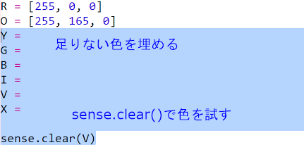

## 虹（にじ）をえがく

まず、Sense HATのLEDマトリックスを使って虹（にじ）をえがきます。 色は赤、橙（だいだい）、黄、緑、青、藍（あい）、紫（むらさき）です。

それぞれのLEDの色を設定するには、赤、緑、青をどれくらいにするか、0から255までの値で指定する必要があります。

+ 「虹（にじ）の予測」の基本Trinkerを開きます：<a href="http://jumpto.cc/rainbow-go" target="_blank">jumpto.cc/rainbow-go</a>
    
    **Sense HATを設定するためのコードが含まれています。**

+ 強調表示されたコードを追加して赤色の変数を設定し、`sense.clear(R)`を使ってすべてのピクセルを赤色にします。
    
    
    
    大文字の`R`を使ってください。

+ 次は橙（だいだい）色です。 橙（だいだい）色は緑色をまぜた赤色です。 好みの橙（だいだい）色になるまで数値を調整します。 今度は`sense.clear(O)`を使って新しい色を試します。かっこの中は大文字の`O`（オー）を使ってください。
    
    

+ ここで虹（にじ）の7つの色になるように変数`Y`、`G`、`B`、`I`，`V`を追加します。 RGBカラーは<a href="http://jumpto.cc/colours" target="_blank">jumpto.cc/colours</a>で調べられます。
    
    `sense.clear()`を使って色を試せます。
    
    

+ ピクセルをオフ（赤、緑、青がすべて0）にするための変数`X`を追加します。
    
    

+ いよいよ虹（にじ）をえがくときが来ました。 それぞれのピクセルの色を含むリストを設定し、その色のリストを`set_pixels`に渡して呼び出す必要があります。 キーボード入力を減らすために、プロジェクトにある`snippets.py`から虹（にじ）をコピーできます。
    
    