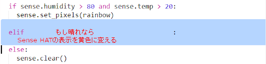

--- challenge ---

## チャレンジ：天気の追加

気温が20度より高くて、湿度が80%より低いときに太陽の画像を表示してみましょう。

ヒント：他の天気を確認するには`elif`を使います。 追加するそれぞれの天気について、天気を確認する条件とSense HAT上に表示するコードを追加する必要があります。

ヒント：`clear()`ですべてのピクセルを黄色に設定することでかんたんに太陽を作ることができます。 または、虹（にじ）でやったようにピクセル画像を作ってみることもできます。

湿度が80%より高く、気温が0度より低いときに雪の画像を表示してみましょう。

ヒント：白色にするには、赤色、緑色、青色を最大値255にします。

--- /challenge ---

***

このプロジェクトは以下のボランティアによって翻訳されました。

齊藤哲哉
大野 雅利

ボランティアのおかげで、世界中の人々に母国語で学ぶ機会を与えることができます。翻訳を引き受けていただくことで、より多くの人々に手を差し伸べることができます。詳しくは [rpf.io/translate](https://rpf.io/translate) をご覧ください。