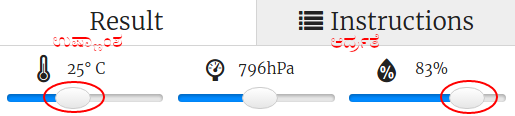

## ಪರಿಚಯ:

ಈ ಯೋಜನೆಯಲ್ಲಿ ನೀವು ಕಾಮನಬಿಲ್ಲು ಗುರುತಿಸಲು ಉತ್ತಮ ಅವಕಾಶವಿದ್ದಾಗ Sense HAT‌ನಲ್ಲಿ ತಾಪಮಾನ ಮತ್ತು ಆರ್ದ್ರತೆ ಸಂವೇದಕಗಳನ್ನು ಬಳಸುತ್ತೀರಿ. ಸರಿಯಾದ ಪರಿಸ್ಥಿತಿಗಳು ಪತ್ತೆಯಾದಾಗ ನೀವು Sense HAT LED Matrixನಲ್ಲಿ ಕಾಮನಬಿಲ್ಲು ಪ್ರದರ್ಶಿಸುತ್ತೀರಿ.

  <iframe src="https://trinket.io/embed/python/eaea4cb76c?outputOnly=true&start=result" width="600" height="500" frameborder="0" marginwidth="0" marginheight="0" allowfullscreen>
</iframe> 

Trinket emulator ನಲ್ಲಿ ನೀವು ತಾಪಮಾನ ಮತ್ತು ತೇವಾಂಶವನ್ನು ಬದಲಾಯಿಸಲು sliders ಗಳನ್ನು ಚಲಿಸಬಹುದು, ಅವು ಈ ರೀತಿ ಕಾಣುತ್ತವೆ:

ತಾಪಮಾನವು 20 ಡಿಗ್ರಿ ಸಿ ಮತ್ತು ಆರ್ದ್ರತೆಯು (humidity) 80 ಪ್ರತಿಶತಕ್ಕಿಂತ ಹೆಚ್ಚಿದ್ದರೆ ನೀವು ಕಾಮನಬಿಲ್ಲು ಪಡೆಯುತ್ತೀರಿ. ಬಿಸಿಲು (ಹಳದಿ) ಮತ್ತು ಹಿಮ (ಬಿಳಿ) ಗಾಗಿ ಹವಾಮಾನ ಪರಿಸ್ಥಿತಿಗಳನ್ನು ಕಂಡುಹಿಡಿಯಲು ಪ್ರಯೋಗವನ್ನು ಪ್ರಯತ್ನಿಸಿ.

### ಕ್ಲಬ್ ಮುಖಂಡರಿಗೆ ಹೆಚ್ಚುವರಿ ಮಾಹಿತಿ

ನೀವು ಈ ಯೋಜನೆಯನ್ನು ಮುದ್ರಿಸಬೇಕಾದರೆ, ದಯವಿಟ್ಟು [ಮುದ್ರಕ-ಸ್ನೇಹಿ ಆವೃತ್ತಿಯನ್ನು ಬಳಸಿ](https://projects.raspberrypi.org/en/projects/rainbow-predictor/print).

## \--- collapse \---

## title: ಕ್ಲಬ್ ನಾಯಕ ಟಿಪ್ಪಣಿಗಳು

## ಪರಿಚಯ:

ಈ ಯೋಜನೆಯಲ್ಲಿ, ಹವಾಮಾನವನ್ನು ಕಂಡುಹಿಡಿಯಲು Sense HAT ಸಂವೇದಕಗಳನ್ನು ಹೇಗೆ ಬಳಸಬೇಕೆಂದು ಮಕ್ಕಳು ಕಲಿಯುತ್ತಾರೆ, ಮತ್ತು LED matrix ಮತ್ತು ಆರ್ದ್ರತೆಯಿದ್ದಾಗ ಕಾಮನಬಿಲ್ಲು ಪ್ರದರ್ಶಿಸುತ್ತಾರೆ.

## ಆನ್‌ಲೈನ್ ಸಂಪನ್ಮೂಲಗಳು

**ಈ ಯೋಜನೆಯು Python 3 ಬಳಸುತ್ತದೆ.** ನೀವು Python ಆನ್‌ಲೈನ್‌ನಲ್ಲಿ ಬರೆಯಲು [Trinket](https://trinket.io/) ಶಿಫಾರಸು ಮಾಡುತ್ತೇವೆ. ಈ ಯೋಜನೆಯು ಈ ಕೆಳಗಿನ Trinkets ಒಳಗೊಂಡಿದೆ:

* ['ರೇನ್ಬೋ ಪ್ರಿಡಿಕ್ಟರ್' Starter Trinket -- jumpto.cc/rainbow-go](http://jumpto.cc/rainbow-go)

ಪೂರ್ಣವಾದ ಯೋಜನೆಯನ್ನು ಒಳಗೊಂಡಿರುವ trinket ಸಹ ಇದೆ:

* ['ರೇನ್ಬೋ ಪ್ರಿಡಿಕ್ಟರ್' Finished -- trinket.io/python/eaea4cb76c](https://trinket.io/python/eaea4cb76c)

## ಆಫ್‌ಲೈನ್ Resources

ಈ ಪ್ರಾಜೆಕ್ಟ್ ಅನ್ನು Sense HAT ಹೊಂದಿರುವ Raspberry Pi ಕಂಪ್ಯೂಟರ್ ನಲ್ಲಿ [ಆಫ್ ಲೈನ್ ನಲ್ಲಿಯೂ ಪೂರ್ಣಗೊಳಿಸಬಹುದು.](https://www.codeclubprojects.org/en-GB/resources/physical-sense-hat/). ಈ ಯೋಜನೆಗಾಗಿ 'Project Materials' ಲಿಂಕ್ ಕ್ಲಿಕ್ ಮಾಡುವ ಮೂಲಕ ನೀವು project resources ಗಳನ್ನು ಪಡೆಯಬಹುದು. ಈ ಲಿಂಕ್ 'Project Resources' ವಿಭಾಗವನ್ನು ಒಳಗೊಂಡಿದೆ, ಇದರಲ್ಲಿ ಮಕ್ಕಳು ಈ project ಆಫ್‌ಲೈನ್‌ನಲ್ಲಿ ಪೂರ್ಣಗೊಳಿಸಲು ಬೇಕಾದ resources ಗಳು ಇವೆ. ಈ resources ಪ್ರತಿಕೃತಿ (Copy) ಪ್ರತಿ ಮಗುವಿಗೆ ಲಭ್ಯವಿದೆ ಎಂದು ಖಚಿತಪಡಿಸಿಕೊಳ್ಳಿ. ಈ ವಿಭಾಗವು ಕೆಳಗಿನ ಫೈಲ್‌ಗಳನ್ನು ಒಳಗೊಂಡಿದೆ:

* rainbow/rainbow.py

ಈ ಯೋಜನೆಯ ಪೂರ್ಣಗೊಂಡ ಆವೃತ್ತಿಯು ಸ್ವಯಂ ಸೇವಕ ಸಂಪನ್ಮೂಲಗಳ (Volunteer Resources) ವಿಭಾಗದಲ್ಲಿ ಲಭ್ಯವಿದ್ದು, ಕೆಳಗಿನ ಫೈಲ್‌ಗಳನ್ನು ಒಳಗೊಂಡಿದೆ:

* rainbow-finished/rainbow.py

(ಮೇಲಿನ ಎಲ್ಲಾ ಸಂಪನ್ಮೂಲಗಳನ್ನು ಯೋಜನೆ ಮತ್ತು ಸ್ವಯಂಸೇವಕ `.zip` ಫೈಲ್‌ಗಳಂತೆ ಡೌನ್‌ಲೋಡ್ ಮಾಡಬಹುದು.)

## ಕಲಿಕೆ ಉದ್ದೇಶಗಳು

* Physical computing - ಸಂವೇದಕಗಳು;
* Boolean AND; 
* RGB Colours;
* Sense HAT display;

This project covers elements from the following strands of the [Raspberry Pi Digital Making Curriculum](https://rpf.io/curriculum):

* [ಸಮಸ್ಯೆಯನ್ನು ಪರಿಹರಿಸಲು ಪ್ರೋಗ್ರಾಮಿಂಗ್ ರಚನೆಗಳನ್ನು ಸಂಯೋಜಿಸಿ.](https://www.raspberrypi.org/curriculum/programming/builder)

## Challenges

* ಹೆಚ್ಚಿನ ಹವಾಮಾನ - ವಿಭಿನ್ನ ಹವಾಮಾನ ಪರಿಸ್ಥಿತಿಗಳಲ್ಲಿ ವಿಭಿನ್ನ ಚಿತ್ರಗಳನ್ನು ಪ್ರದರ್ಶಿಸಿ. 

\--- /collapse \---

## \--- collapse \---

## title: ಯೋಜನೆಯ ವಸ್ತುಗಳು

## ಯೋಜನೆಯ ಸಂಪನ್ಮೂಲಗಳು

* [ಸ್ಟಾರ್ಟರ್ ಯೋಜನೆ](http://jumpto.cc/rainbow-go)
* [ಆಫ್‌ಲೈನ್ ಸ್ಟಾರ್ಟರ್ Python ಫೈಲ್](resources/rainbow-rainbow.py)

## ಕ್ಲಬ್ ನಾಯಕರ ಸಂಪನ್ಮೂಲಗಳು

* [ಆನ್‌ಲೈನ್ ಪೂರ್ಣಗೊಂಡ Trinket ಯೋಜನೆ](https://trinket.io/python/eaea4cb76c)
* [rainbow-finished/rainbow.py](resources/rainbow-final-rainbow.py)

\--- /collapse \---