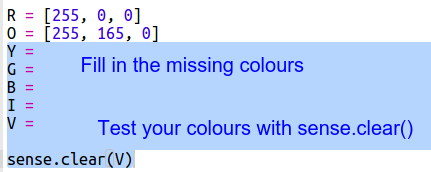
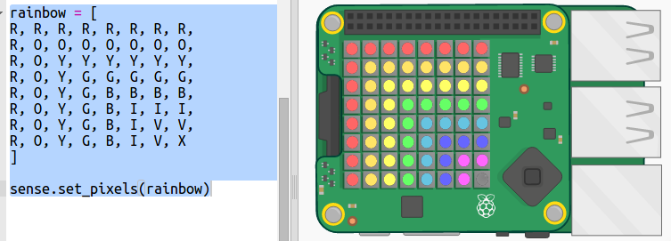

## ಕಾಮನಬಿಲ್ಲು ಚಿತ್ರಿಸುವುದು

ಮೊದಲು Sense HAT ‌ನಲ್ಲಿ LED Matrix ಬಳಸಿ ಕಾಮನಬಿಲ್ಲು ಸೆಳೆಯೋಣ. ಕೆಂಪು, ಕಿತ್ತಳೆ, ಹಳದಿ, ಹಸಿರು, ನೀಲಿ, ಇಂಡಿಗೊ ಮತ್ತು ನೇರಳೆ ಬಣ್ಣಗಳು.

ಪ್ರತ್ಯೇಕ LED ಬಣ್ಣವನ್ನು ಹೊಂದಿಸಲು ನಾವು 0 ರಿಂದ 255 ರವರೆಗೆ ಎಷ್ಟು ಕೆಂಪು, ಹಸಿರು ಮತ್ತು ನೀಲಿ ಬಣ್ಣಗಳನ್ನು ಹೊಂದಿರಬೇಕು ಎಂದು ಹೇಳಬೇಕಾಗಿದೆ.

+ ರೇನ್ಬೋ ಪ್ರಿಡಿಕ್ಟರ್ Starter Trinket ತೆರೆಯಿರಿ: <a href="http://jumpto.cc/rainbow-go" target="_blank"> jumpto.cc/rainbow-go </a>.
    
    **Sense HAT ಅನ್ನು ಹೊಂದಿಸುವ code ಅನ್ನು ನಿಮಗಾಗಿ ಸೇರಿಸಲಾಗಿದೆ.**

+ ಕೆಂಪು ಬಣ್ಣಕ್ಕೆ ವೇರಿಯೇಬಲ್ ಅನ್ನು ಹೊಂದಿಸಲು ಹೈಲೈಟ್ ಮಾಡಿದ code ಸೇರಿಸಿ ಮತ್ತು ನಂತರ ಎಲ್ಲಾ ಪಿಕ್ಸೆಲ್‌ಗಳನ್ನು ಕೆಂಪು ಮಾಡಿ `sense.clear(R)` ಬಳಸಿ:
    
    
    
    ನೀವು ದೊಡ್ಡ ಅಕ್ಷರ `R` ಅನ್ನು ಬಳಸುತ್ತಿದ್ದೀರಿ ಎಂಬುದನ್ನು ಖಚಿತಪಡಿಸಿಕೊಳ್ಳಿ.

+ ಕಿತ್ತಳೆ ಮುಂದಿನದು. ಕಿತ್ತಳೆ ಹಸಿರು ಬಣ್ಣದೊಂದಿಗೆ ಕೆಂಪು ಬಣ್ಣದ್ದಾಗಿದೆ. ನೀವು ಇಷ್ಟಪಡುವ ಕಿತ್ತಳೆ ಬಣ್ಣವನ್ನು ಪಡೆಯುವವರೆಗೆ ನೀವು ಸಂಖ್ಯೆಗಳನ್ನು ಹೊಂದಿಸಬಹುದು. `sense.clear(O) ` ಬಳಸಿ ಹೊಸ ಬಣ್ಣವನ್ನು ಪರೀಕ್ಷಿಸಲು ಈ ಸಮಯದಲ್ಲಿ, ದೊಡ್ಡ ಅಕ್ಷರ ` O ` ಅನ್ನು ಬಳಸುವುದನ್ನು ಖಚಿತಪಡಿಸಿಕೊಳ್ಳಿ ಆವರಣಗಳಲ್ಲಿ.
    
    

+ ಈಗ ವೇರಿಯೇಬಲ್ಸ್ ಗಳನ್ನು ಸೇರಿಸಿ `Y`, `G`, `B`, `I`, `V` ಆದ್ದರಿಂದ ನೀವು ಕಾಮನಬಿಲ್ಲು ಏಳು ಬಣ್ಣಗಳನ್ನು ಹೊಂದಿದ್ದೀರಿ. ನೀವು <a href="http://jumpto.cc/colours" target="_blank">jumpto.cc/colours</a> ನಲ್ಲಿ RGB ಬಣ್ಣಗಳನ್ನು ನೋಡಬಹುದು
    
    `sense.clear()` ಬಳಸಿ ನಿಮ್ಮ ಬಣ್ಣಗಳನ್ನು ನೀವು ಪರೀಕ್ಷಿಸಬಹುದು.
    
    

+ ವೇರಿಯಬಲ್ `X` ಸೇರಿಸಿ ಪಿಕ್ಸೆಲ್‌ಗಳನ್ನು ಆಫ್ ಮಾಡಲು (ಕೆಂಪು, ಹಸಿರು ಅಥವಾ ನೀಲಿ ಇಲ್ಲ):
    
    

+ ಈಗ ಕಾಮನಬಿಲ್ಲು ಸೆಳೆಯುವ ಸಮಯ ಬಂದಿದೆ. ಪ್ರತಿ ಪಿಕ್ಸೆಲ್‌ನ ಬಣ್ಣವನ್ನು ಹೊಂದಿರುವ ಪಟ್ಟಿಯನ್ನು ನೀವು ಹೊಂದಿಸಬೇಕಾಗಿದೆ ಮತ್ತು ನಂತರ ` set_pixels` ಕರೆ ಮಾಡಿ ಬಣ್ಣಗಳ ಪಟ್ಟಿಯೊಂದಿಗೆ. ಟೈಪಿಂಗ್ ಅನ್ನು ಉಳಿಸಲು ನಿಮ್ಮ ಯೋಜನೆಯಲ್ಲಿ ನೀವು ` snippets.py ` ನಿಂದ ಕಾಮನಬಿಲ್ಲು ನಕಲಿಸಬಹುದು.
    
    