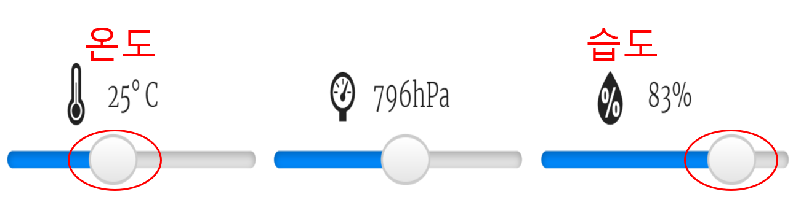

## 소개

이 프로젝트에서는 Sense HAT의 온도 및 습도 센서를 사용하여 무지개를 발견 할 가능성이 높은 시기를 예측합니다. 알맞은 조건이 감지되면 Sense HAT LED 매트릭스에 무지개가 표시됩니다.

  <iframe src="https://trinket.io/embed/python/eaea4cb76c?outputOnly=true&start=result" width="600" height="500" frameborder="0" marginwidth="0" marginheight="0" allowfullscreen mark="crwd-mark">
</iframe> 

Trinket 에뮬레이터의 슬라이더를 움직여 온도와 습도를 변경할 수 있습니다.

온도가 섭씨 20도 이상이고 습도가 80%를 초과하면 무지개가 나타납니다. 햇빛(노란색) 과 눈(흰색) 의 기상 조건을 찾기 위해 실험을 해보세요.

### 교육자들을 위한 추가 정보

이 프로젝트를 인쇄하려면 [프린트용 문서](https://projects.raspberrypi.org/ko-KR/projects/rainbow-predictor/print)를 사용하십시오.

--- collapse ---
---
title: 교육자 노트
---

## 소개

이 프로젝트에서 어린이들은 Sense HAT 센서를 사용하여 날씨를 감지하고, 따뜻하고 습한 경우 LED 매트릭스를 사용하여 무지개를 표시하는 방법을 배우게됩니다.

## 온라인 자료들

**이 프로젝트는 Python 3를 사용합니다.** 파이썬 코드를 온라인에서 작성하기 위해 [Trinket](https://trinket.io/)을 사용하는 것을 추천합니다. 이 프로젝트에 포함된 Trinket은 다음과 같습니다:

* ['무지개 예측기' 스타터 Trinket -- jumpto.cc/rainbow-go](http://jumpto.cc/rainbow-go)

완성된 프로젝트가 저장된 Trinket도 있습니다:

* ['무지개 예측기' 완성본 -- trinket.io/python/bd5a8f4702](https://trinket.io/python/bd5a8f4702)

## 오프라인 자료들

또한, 이 프로젝트는 Raspberry Pi 컴퓨터에서 Sense Hat으로 [오프라인](https://www.codeclubprojects.org/en-GB/resources/physical-sense-hat/)으로 완료할 수 있습니다. 'Project Materials' 라는 링크를 클릭하여 이 프로젝트의 자료를 확인해볼 수 있습니다. 이 링크에는 학생들이 프로젝트를 오프라인으로 완료하는 데 필요한 자료가 포함된 'Project Resource' 섹션이 있습니다. 학생들이 이러한 자료의 사본에 접근할 수 있는 지 확인하십시오. 이 섹션에는 아래와 같은 파일들이 포함되어 있습니다.

* rainbow/rainbow.py

이 프로젝트의 완성된 버전은 'Volunteer Resources' 섹션에서 찾을 수 있습니다.

* rainbow-finished/rainbow.py

(또한 위의 모든 자료는 프로젝트 및 자원봉사자 `.zip` 파일로 다운로드 할 수 있습니다.)

## 학습 목표

* 피지컬 컴퓨팅 - 센서들;
* 불 자료형 - AND; 
* RGB 색상들;
* Sense Hat 디스플레이;

이 프로젝트는 [라즈베리파이 디지털 메이킹 커리큘럼](http://rpf.io/curriculum) 중 아래의 과정에 있는 요소들을 다룹니다.

* [프로그래밍 구조를 결합하여 문제 해결하기](https://www.raspberrypi.org/curriculum/programming/builder)

## 도전과제

* 더 많은 날씨 - 날씨 조건에 따라 다른 이미지들을 표시합니다. 

--- /collapse ---

--- collapse ---
---
title: 프로젝트 자료
---

## 프로젝트 리소스

* [스타터 프로젝트](http://jumpto.cc/rainbow-go)
* [오프라인 스타터 Python파일](resources/rainbow-rainbow.py)

## 교육자를 위한 자료

* [완성된 온라인 Trinket 프로젝트](https://trinket.io/python/eaea4cb76c)
* [rainbow-finished/rainbow.py](resources/rainbow-final-rainbow.py)

-- /collapse ---