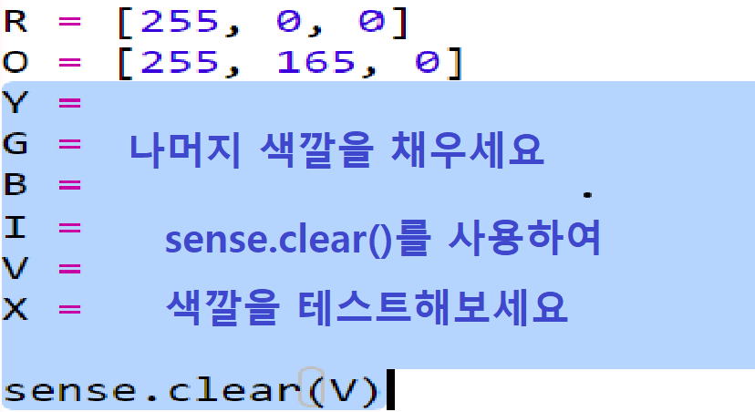

## 무지개 그리기

먼저 Sense Hat의 LED 매트릭스를 사용하여 무지개를 그립니다. 색상은 빨강, 주황, 노랑, 녹색, 파랑, 남색 및 보라색입니다.

개별 LED의 색상을 설정하려면 0에서 255 사이의 빨강, 녹색 및 파랑색의 양을 말해야합니다.

+ 무지개 예측기 스타터 Trinket을 엽니다. <a href="http://jumpto.cc/rainbow-go" target="_blank">jumpto.cc/rainbow-go</a>
    
    **Sense HAT를 설정하는 코드가 포함되었습니다.**

+ 강조 표시된 코드를 추가하여 빨간색에 대한 변수를 설정 한 다음 `sense.clear(R)`을 사용하여 모든 픽셀을 빨간색으로 설정하세요.
    
    
    
    대문자 `R`을 사용해야 합니다.

+ 다음은 주황색입니다. 주황색은 빨간색과 녹색이 혼합되어 있습니다. 원하는 주황색이 될 때까지 숫자를 조정할 수 있습니다. 이번에는 `sense.clear(O)` 를 사용하여 새로운 색깔을 시험해봅니다. 대문자 `O`를 사용하였는지 확인하세요.
    
    

+ 무지개의 일곱 가지 색을 갖도록 변수 `Y`, `G`, `B`, `I`, `V`를 추가하세요. <a href="http://jumpto.cc/colours" target="_blank">jumpto.cc/colours</a>에서 RGB색깔을 찾을 수 있습니다.
    
    `sense.clear()`을 사용하여 여러분의 색깔을 테스트 할 수 있습니다.
    
    

+ 픽셀을 끄기 위해 변수 `X`를 추가합니다. (빨강, 녹색, 파랑 아님)
    
    

+ 이제 무지개를 그려 봅시다. 각 픽셀의 색깔이 포함된 목록을 설정한 다음, 색깔 목록과 함께 `set_pixels`를 호출해야 합니다. 프로젝트에서 입력한 값을 저장하기 위해 `snippets.py`에서 무지개를 복사할 수 있습니다.
    
    